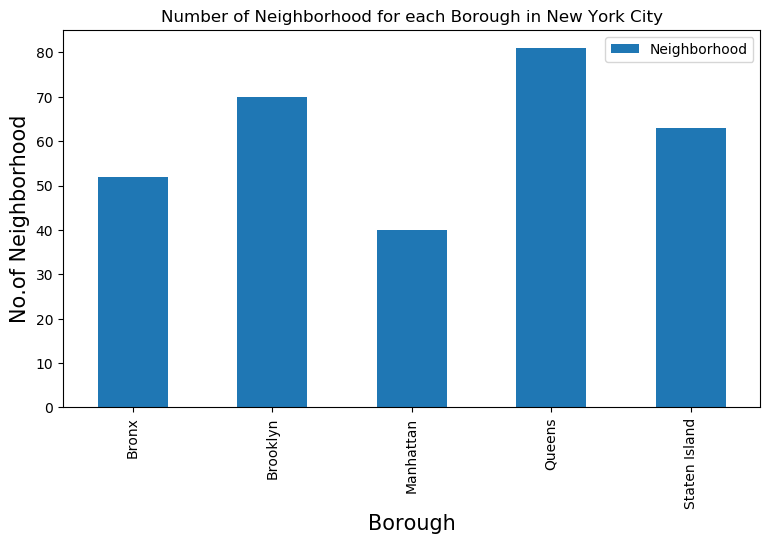
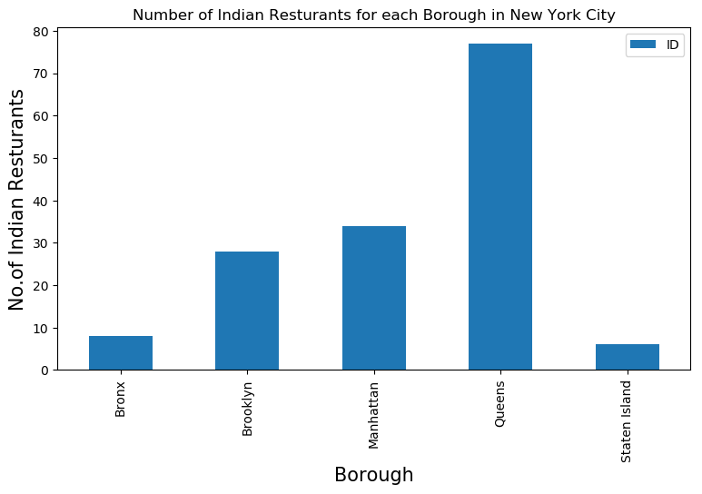
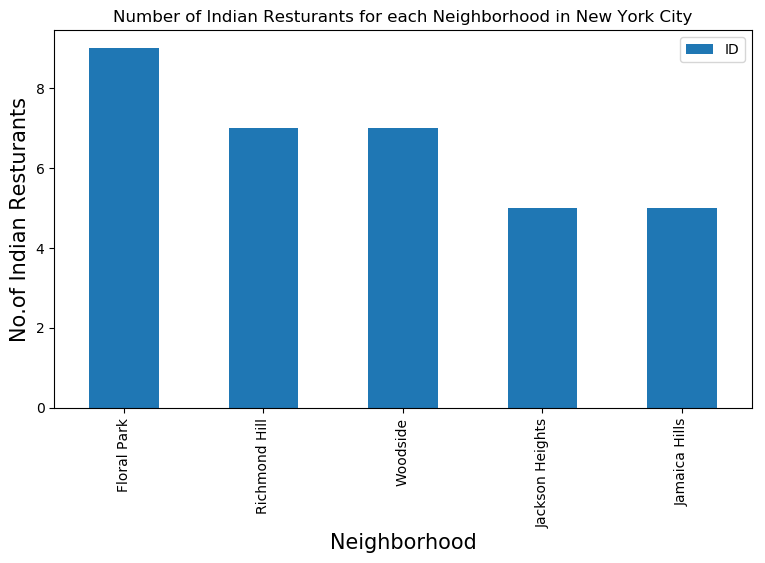
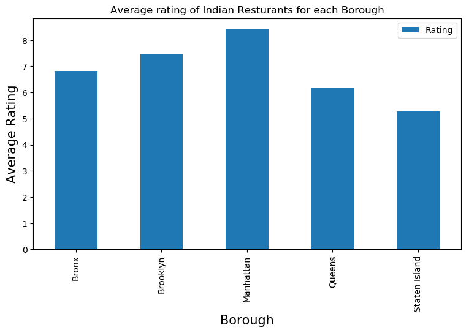

# Capstone Project - The Battle of Neighborhoods

### Introduction

New York City's demographics show that it is a large and ethnically diverse metropolis. It is the largest city in the United States with a long history of international immigration. New York City was home to nearly 8.5 million people in 2014, accounting for over 40% of the population of New York State and a slightly lower percentage of the New York metropolitan area, home to approximately 23.6 million. Over the last decade the city has been growing faster than the region. The New York region continues to be by far the leading metropolitan gateway for legal immigrants admitted into the United States.

Throughout its history, New York City has been a major point of entry for immigrants; the term "melting pot" was coined to describe densely populated immigrant neighborhoods on the Lower East Side. As many as 800 languages are spoken in New York, making it the most linguistically diverse city in the world. English remains the most widely spoken language, although there are areas in the outer boroughs in which up to 25% of people speak English as an alternate language, and/or have limited or no English language fluency. English is least spoken in neighborhoods such as Flushing, Sunset Park, and Corona.

With it's diverse culture , comes diverse food items. There are many resturants in New york City, each beloning to different categories like Chinese , Indian , French etc.

So as part of this project , we will list and visualize all major parts of New York City that has great indian resturants.

### Data 
For this project we need the following data :
<ul>
<li> New York City data that contains list Boroughs, Neighborhoods along with their latitude and longitude.
    <ul>
        <li>Data source : https://cocl.us/new_york_dataset
        <li> Description : This data set contains the required information. And we will use this data set to explore various neighborhoods of new york city.
     </ul>
<li> Indian resturants in each neighborhood of new york city.
        <ul>
        <li>Data source : Fousquare API
        <li> Description : By using this api we will get all the venues in each neighborhood. We can filter these venues to get only indian resturants.
     </ul>
<li> GeoSpace data
          <ul>
        <li>Data source : https://data.cityofnewyork.us/City-Government/Borough-Boundaries/tqmj-j8zm
        <li> Description : By using this geo space data we will get the New york Borough boundaries that will help us visualize choropleth map.
  
</ul>

### Approach
- Collect the new york city data from https://cocl.us/new_york_dataset
- Using FourSquare API we will find all venues for each neighborhood.
- Filter out all venues that are Indian Resturants.
- Find rating , tips and like count for each Indian Resturants using FourSquare API.
- Using rating for each resturant , we will sort that data.
- Visualize the Ranking of neighborhoods using folium library(python)

### Questions that can be asked using the above mentioned datasets
- What is best location in New York City for Indian Cuisine ? 
- Which areas have potential Indian Resturant Market ? 
- Which all areas lack Indian Resturants ?
- Which is the best place to stay if I prefer Indian Cuisine ?

### Analysis

We will import the required libraries for python.

- pandas and numpy for handling data.
- request module for using FourSquare API.
- geopy to get co-ordinates of City of New York.
- folium to visualize the results on a map


```python
import pandas as pd
import numpy as np
pd.set_option('display.max_columns', None)
pd.set_option('display.max_rows', None)
import requests
from bs4 import BeautifulSoup
import geocoder
import os
import folium # map rendering library
from geopy.geocoders import Nominatim # convert an address into latitude and longitude values
# Matplotlib and associated plotting modules
import matplotlib.pyplot as plt
import matplotlib.cm as cm
import matplotlib.colors as colors
%matplotlib inline


print('Libraries imported.')
```

    Libraries imported.
    

Now we define a function to get the geocodes i.e latitude and longitude of a given location using geopy.


```python
def geo_location(address):
    # get geo location of address
    geolocator = Nominatim(user_agent="ny_explorer")
    location = geolocator.geocode(address)
    latitude = location.latitude
    longitude = location.longitude
    return latitude,longitude
```

We define a function to intract with FourSquare API and get top 100 venues within a radius of 1000 metres for a given  latitude and longitude. Below function will return us the venue id , venue name and category.


```python
def get_venues(lat,lng):
    
    #set variables
    radius=1000
    LIMIT=100
    CLIENT_ID = os.environ['CLIENT_ID'] # your Foursquare ID
    CLIENT_SECRET = os.environ['CLIENT_SECRET'] # your Foursquare Secret
    VERSION = '20180605' # Foursquare API version
    
    #url to fetch data from foursquare api
    url = 'https://api.foursquare.com/v2/venues/explore?&client_id={}&client_secret={}&v={}&ll={},{}&radius={}&limit={}'.format(
            CLIENT_ID, 
            CLIENT_SECRET, 
            VERSION, 
            lat, 
            lng, 
            radius, 
            LIMIT)
    
    # get all the data
    results = requests.get(url).json()
    venue_data=results["response"]['groups'][0]['items']
    venue_details=[]
    for row in venue_data:
        try:
            venue_id=row['venue']['id']
            venue_name=row['venue']['name']
            venue_category=row['venue']['categories'][0]['name']
            venue_details.append([venue_id,venue_name,venue_category])
        except KeyError:
            pass
        
    column_names=['ID','Name','Category']
    df = pd.DataFrame(venue_details,columns=column_names)
    return df
    
```

Now we will define a function to get venue details like like count , rating , tip counts for a given venue id.
This will be used for ranking.


```python
def get_venue_details(venue_id):
        
    CLIENT_ID = os.environ['CLIENT_ID'] # your Foursquare ID
    CLIENT_SECRET = os.environ['CLIENT_SECRET'] # your Foursquare Secret
    VERSION = '20180605' # Foursquare API version
    
    #url to fetch data from foursquare api
    url = 'https://api.foursquare.com/v2/venues/{}?&client_id={}&client_secret={}&v={}'.format(
            venue_id,
            CLIENT_ID, 
            CLIENT_SECRET, 
            VERSION)
    
    # get all the data
    results = requests.get(url).json()
    venue_data=results['response']['venue']
    venue_details=[]
    try:
        venue_id=venue_data['id']
        venue_name=venue_data['name']
        venue_likes=venue_data['likes']['count']
        venue_rating=venue_data['rating']
        venue_tips=venue_data['tips']['count']
        venue_details.append([venue_id,venue_name,venue_likes,venue_rating,venue_tips])
    except KeyError:
        pass
        
    column_names=['ID','Name','Likes','Rating','Tips']
    df = pd.DataFrame(venue_details,columns=column_names)
    return df

```

Now we define a funtion to get the new york city data such as Boroughs, Neighborhoods along with their latitude and longitude.


```python
def get_new_york_data():
    url='https://cocl.us/new_york_dataset'
    resp=requests.get(url).json()
    # all data is present in features label
    features=resp['features']
    
    # define the dataframe columns
    column_names = ['Borough', 'Neighborhood', 'Latitude', 'Longitude'] 
    # instantiate the dataframe
    new_york_data = pd.DataFrame(columns=column_names)
    
    for data in features:
        borough = data['properties']['borough'] 
        neighborhood_name = data['properties']['name']
        
        neighborhood_latlon = data['geometry']['coordinates']
        neighborhood_lat = neighborhood_latlon[1]
        neighborhood_lon = neighborhood_latlon[0]
    
        new_york_data = new_york_data.append({'Borough': borough,
                                          'Neighborhood': neighborhood_name,
                                          'Latitude': neighborhood_lat,
                                          'Longitude': neighborhood_lon}, ignore_index=True)
    
    return new_york_data
```

We will call the above funtion to get the new york city data.


```python
# get new york data
new_york_data=get_new_york_data()
```


```python
new_york_data.head()
```


<div>
<style scoped>
    .dataframe tbody tr th:only-of-type {
        vertical-align: middle;
    }

    .dataframe tbody tr th {
        vertical-align: top;
    }

    .dataframe thead th {
        text-align: right;
    }
</style>
<table border="1" class="dataframe">
  <thead>
    <tr style="text-align: right;">
      <th></th>
      <th>Borough</th>
      <th>Neighborhood</th>
      <th>Latitude</th>
      <th>Longitude</th>
    </tr>
  </thead>
  <tbody>
    <tr>
      <th>0</th>
      <td>Bronx</td>
      <td>Wakefield</td>
      <td>40.894705</td>
      <td>-73.847201</td>
    </tr>
    <tr>
      <th>1</th>
      <td>Bronx</td>
      <td>Co-op City</td>
      <td>40.874294</td>
      <td>-73.829939</td>
    </tr>
    <tr>
      <th>2</th>
      <td>Bronx</td>
      <td>Eastchester</td>
      <td>40.887556</td>
      <td>-73.827806</td>
    </tr>
    <tr>
      <th>3</th>
      <td>Bronx</td>
      <td>Fieldston</td>
      <td>40.895437</td>
      <td>-73.905643</td>
    </tr>
    <tr>
      <th>4</th>
      <td>Bronx</td>
      <td>Riverdale</td>
      <td>40.890834</td>
      <td>-73.912585</td>
    </tr>
  </tbody>
</table>
</div>


```python
new_york_data.shape
```


    (306, 4)


So there are total of 306 different Neighborhoods in New York


```python
plt.figure(figsize=(9,5), dpi = 100)
# title
plt.title('Number of Neighborhood for each Borough in New York City')
#On x-axis
plt.xlabel('Borough', fontsize = 15)
#On y-axis
plt.ylabel('No.of Neighborhood', fontsize=15)
#giving a bar plot
new_york_data.groupby('Borough')['Neighborhood'].count().plot(kind='bar')
#legend
plt.legend()
#displays the plot
plt.show()
```





We see that Queens has highest number of neighborhoods

Now we will collect Indian resturants for each Neighborhood


```python
# prepare neighborhood list that contains indian resturants
column_names=['Borough', 'Neighborhood', 'ID','Name']
indian_rest_ny=pd.DataFrame(columns=column_names)
count=1
for row in new_york_data.values.tolist():
    Borough, Neighborhood, Latitude, Longitude=row
    venues = get_venues(Latitude,Longitude)
    indian_resturants=venues[venues['Category']=='Indian Restaurant']   
    print('(',count,'/',len(new_york_data),')','Indian Resturants in '+Neighborhood+', '+Borough+':'+str(len(indian_resturants)))
    for resturant_detail in indian_resturants.values.tolist():
        id, name , category=resturant_detail
        indian_rest_ny = indian_rest_ny.append({'Borough': Borough,
                                                'Neighborhood': Neighborhood, 
                                                'ID': id,
                                                'Name' : name
                                               }, ignore_index=True)
    count+=1
```

    ( 1 / 306 ) Indian Resturants in Wakefield, Bronx:0
    ( 2 / 306 ) Indian Resturants in Co-op City, Bronx:0
    ( 3 / 306 ) Indian Resturants in Eastchester, Bronx:0
    ( 4 / 306 ) Indian Resturants in Fieldston, Bronx:0
    ( 5 / 306 ) Indian Resturants in Riverdale, Bronx:1
    ( 6 / 306 ) Indian Resturants in Kingsbridge, Bronx:1
    ( 7 / 306 ) Indian Resturants in Marble Hill, Manhattan:0
    ( 8 / 306 ) Indian Resturants in Woodlawn, Bronx:1
    ( 9 / 306 ) Indian Resturants in Norwood, Bronx:0
    ( 10 / 306 ) Indian Resturants in Williamsbridge, Bronx:0
    ( 11 / 306 ) Indian Resturants in Baychester, Bronx:0
    ( 12 / 306 ) Indian Resturants in Pelham Parkway, Bronx:0
    ( 13 / 306 ) Indian Resturants in City Island, Bronx:0
    ( 14 / 306 ) Indian Resturants in Bedford Park, Bronx:0
    ( 15 / 306 ) Indian Resturants in University Heights, Bronx:0
    ( 16 / 306 ) Indian Resturants in Morris Heights, Bronx:0
    ( 17 / 306 ) Indian Resturants in Fordham, Bronx:0
    ( 18 / 306 ) Indian Resturants in East Tremont, Bronx:0
    ( 19 / 306 ) Indian Resturants in West Farms, Bronx:0
    ( 20 / 306 ) Indian Resturants in High  Bridge, Bronx:0
    ( 21 / 306 ) Indian Resturants in Melrose, Bronx:0
    ( 22 / 306 ) Indian Resturants in Mott Haven, Bronx:0
    ( 23 / 306 ) Indian Resturants in Port Morris, Bronx:0
    ( 24 / 306 ) Indian Resturants in Longwood, Bronx:0
    ( 25 / 306 ) Indian Resturants in Hunts Point, Bronx:0
    ( 26 / 306 ) Indian Resturants in Morrisania, Bronx:0
    ( 27 / 306 ) Indian Resturants in Soundview, Bronx:0
    ( 28 / 306 ) Indian Resturants in Clason Point, Bronx:0
    ( 29 / 306 ) Indian Resturants in Throgs Neck, Bronx:0
    ( 30 / 306 ) Indian Resturants in Country Club, Bronx:0
    ( 31 / 306 ) Indian Resturants in Parkchester, Bronx:1
    ( 32 / 306 ) Indian Resturants in Westchester Square, Bronx:0
    ( 33 / 306 ) Indian Resturants in Van Nest, Bronx:0
    ( 34 / 306 ) Indian Resturants in Morris Park, Bronx:0
    ( 35 / 306 ) Indian Resturants in Belmont, Bronx:0
    ( 36 / 306 ) Indian Resturants in Spuyten Duyvil, Bronx:1
    ( 37 / 306 ) Indian Resturants in North Riverdale, Bronx:0
    ( 38 / 306 ) Indian Resturants in Pelham Bay, Bronx:0
    ( 39 / 306 ) Indian Resturants in Schuylerville, Bronx:0
    ( 40 / 306 ) Indian Resturants in Edgewater Park, Bronx:0
    ( 41 / 306 ) Indian Resturants in Castle Hill, Bronx:0
    ( 42 / 306 ) Indian Resturants in Olinville, Bronx:0
    ( 43 / 306 ) Indian Resturants in Pelham Gardens, Bronx:0
    ( 44 / 306 ) Indian Resturants in Concourse, Bronx:1
    ( 45 / 306 ) Indian Resturants in Unionport, Bronx:1
    ( 46 / 306 ) Indian Resturants in Edenwald, Bronx:0
    ( 47 / 306 ) Indian Resturants in Bay Ridge, Brooklyn:2
    ( 48 / 306 ) Indian Resturants in Bensonhurst, Brooklyn:0
    ( 49 / 306 ) Indian Resturants in Sunset Park, Brooklyn:0
    ( 50 / 306 ) Indian Resturants in Greenpoint, Brooklyn:0
    ( 51 / 306 ) Indian Resturants in Gravesend, Brooklyn:0
    ( 52 / 306 ) Indian Resturants in Brighton Beach, Brooklyn:1
    ( 53 / 306 ) Indian Resturants in Sheepshead Bay, Brooklyn:0
    ( 54 / 306 ) Indian Resturants in Manhattan Terrace, Brooklyn:0
    ( 55 / 306 ) Indian Resturants in Flatbush, Brooklyn:2
    ( 56 / 306 ) Indian Resturants in Crown Heights, Brooklyn:0
    ( 57 / 306 ) Indian Resturants in East Flatbush, Brooklyn:1
    ( 58 / 306 ) Indian Resturants in Kensington, Brooklyn:2
    ( 59 / 306 ) Indian Resturants in Windsor Terrace, Brooklyn:0
    ( 60 / 306 ) Indian Resturants in Prospect Heights, Brooklyn:0
    ( 61 / 306 ) Indian Resturants in Brownsville, Brooklyn:0
    ( 62 / 306 ) Indian Resturants in Williamsburg, Brooklyn:0
    ( 63 / 306 ) Indian Resturants in Bushwick, Brooklyn:0
    ( 64 / 306 ) Indian Resturants in Bedford Stuyvesant, Brooklyn:0
    ( 65 / 306 ) Indian Resturants in Brooklyn Heights, Brooklyn:0
    ( 66 / 306 ) Indian Resturants in Cobble Hill, Brooklyn:0
    ( 67 / 306 ) Indian Resturants in Carroll Gardens, Brooklyn:0
    ( 68 / 306 ) Indian Resturants in Red Hook, Brooklyn:0
    ( 69 / 306 ) Indian Resturants in Gowanus, Brooklyn:1
    ( 70 / 306 ) Indian Resturants in Fort Greene, Brooklyn:1
    ( 71 / 306 ) Indian Resturants in Park Slope, Brooklyn:0
    ( 72 / 306 ) Indian Resturants in Cypress Hills, Brooklyn:0
    ( 73 / 306 ) Indian Resturants in East New York, Brooklyn:0
    ( 74 / 306 ) Indian Resturants in Starrett City, Brooklyn:0
    ( 75 / 306 ) Indian Resturants in Canarsie, Brooklyn:0
    ( 76 / 306 ) Indian Resturants in Flatlands, Brooklyn:0
    ( 77 / 306 ) Indian Resturants in Mill Island, Brooklyn:0
    ( 78 / 306 ) Indian Resturants in Manhattan Beach, Brooklyn:0
    ( 79 / 306 ) Indian Resturants in Coney Island, Brooklyn:0
    ( 80 / 306 ) Indian Resturants in Bath Beach, Brooklyn:0
    ( 81 / 306 ) Indian Resturants in Borough Park, Brooklyn:0
    ( 82 / 306 ) Indian Resturants in Dyker Heights, Brooklyn:0
    ( 83 / 306 ) Indian Resturants in Gerritsen Beach, Brooklyn:0
    ( 84 / 306 ) Indian Resturants in Marine Park, Brooklyn:0
    ( 85 / 306 ) Indian Resturants in Clinton Hill, Brooklyn:2
    ( 86 / 306 ) Indian Resturants in Sea Gate, Brooklyn:0
    ( 87 / 306 ) Indian Resturants in Downtown, Brooklyn:0
    ( 88 / 306 ) Indian Resturants in Boerum Hill, Brooklyn:0
    ( 89 / 306 ) Indian Resturants in Prospect Lefferts Gardens, Brooklyn:2
    ( 90 / 306 ) Indian Resturants in Ocean Hill, Brooklyn:2
    ( 91 / 306 ) Indian Resturants in City Line, Brooklyn:1
    ( 92 / 306 ) Indian Resturants in Bergen Beach, Brooklyn:0
    ( 93 / 306 ) Indian Resturants in Midwood, Brooklyn:0
    ( 94 / 306 ) Indian Resturants in Prospect Park South, Brooklyn:3
    ( 95 / 306 ) Indian Resturants in Georgetown, Brooklyn:0
    ( 96 / 306 ) Indian Resturants in East Williamsburg, Brooklyn:0
    ( 97 / 306 ) Indian Resturants in North Side, Brooklyn:1
    ( 98 / 306 ) Indian Resturants in South Side, Brooklyn:1
    ( 99 / 306 ) Indian Resturants in Ocean Parkway, Brooklyn:0
    ( 100 / 306 ) Indian Resturants in Fort Hamilton, Brooklyn:1
    ( 101 / 306 ) Indian Resturants in Chinatown, Manhattan:0
    ( 102 / 306 ) Indian Resturants in Washington Heights, Manhattan:1
    ( 103 / 306 ) Indian Resturants in Inwood, Manhattan:0
    ( 104 / 306 ) Indian Resturants in Hamilton Heights, Manhattan:2
    ( 105 / 306 ) Indian Resturants in Manhattanville, Manhattan:2
    ( 106 / 306 ) Indian Resturants in Central Harlem, Manhattan:2
    ( 107 / 306 ) Indian Resturants in East Harlem, Manhattan:1
    ( 108 / 306 ) Indian Resturants in Upper East Side, Manhattan:0
    ( 109 / 306 ) Indian Resturants in Yorkville, Manhattan:1
    ( 110 / 306 ) Indian Resturants in Lenox Hill, Manhattan:1
    ( 111 / 306 ) Indian Resturants in Roosevelt Island, Manhattan:1
    ( 112 / 306 ) Indian Resturants in Upper West Side, Manhattan:2
    ( 113 / 306 ) Indian Resturants in Lincoln Square, Manhattan:0
    ( 114 / 306 ) Indian Resturants in Clinton, Manhattan:0
    ( 115 / 306 ) Indian Resturants in Midtown, Manhattan:1
    ( 116 / 306 ) Indian Resturants in Murray Hill, Manhattan:1
    ( 117 / 306 ) Indian Resturants in Chelsea, Manhattan:0
    ( 118 / 306 ) Indian Resturants in Greenwich Village, Manhattan:0
    ( 119 / 306 ) Indian Resturants in East Village, Manhattan:0
    ( 120 / 306 ) Indian Resturants in Lower East Side, Manhattan:0
    ( 121 / 306 ) Indian Resturants in Tribeca, Manhattan:1
    ( 122 / 306 ) Indian Resturants in Little Italy, Manhattan:0
    ( 123 / 306 ) Indian Resturants in Soho, Manhattan:0
    ( 124 / 306 ) Indian Resturants in West Village, Manhattan:0
    ( 125 / 306 ) Indian Resturants in Manhattan Valley, Manhattan:3
    ( 126 / 306 ) Indian Resturants in Morningside Heights, Manhattan:1
    ( 127 / 306 ) Indian Resturants in Gramercy, Manhattan:3
    ( 128 / 306 ) Indian Resturants in Battery Park City, Manhattan:0
    ( 129 / 306 ) Indian Resturants in Financial District, Manhattan:1
    ( 130 / 306 ) Indian Resturants in Astoria, Queens:1
    ( 131 / 306 ) Indian Resturants in Woodside, Queens:7
    ( 132 / 306 ) Indian Resturants in Jackson Heights, Queens:5
    ( 133 / 306 ) Indian Resturants in Elmhurst, Queens:2
    ( 134 / 306 ) Indian Resturants in Howard Beach, Queens:0
    ( 135 / 306 ) Indian Resturants in Corona, Queens:0
    ( 136 / 306 ) Indian Resturants in Forest Hills, Queens:0
    ( 137 / 306 ) Indian Resturants in Kew Gardens, Queens:2
    ( 138 / 306 ) Indian Resturants in Richmond Hill, Queens:7
    ( 139 / 306 ) Indian Resturants in Flushing, Queens:0
    ( 140 / 306 ) Indian Resturants in Long Island City, Queens:3
    ( 141 / 306 ) Indian Resturants in Sunnyside, Queens:1
    ( 142 / 306 ) Indian Resturants in East Elmhurst, Queens:0
    ( 143 / 306 ) Indian Resturants in Maspeth, Queens:0
    ( 144 / 306 ) Indian Resturants in Ridgewood, Queens:1
    ( 145 / 306 ) Indian Resturants in Glendale, Queens:0
    ( 146 / 306 ) Indian Resturants in Rego Park, Queens:1
    ( 147 / 306 ) Indian Resturants in Woodhaven, Queens:1
    ( 148 / 306 ) Indian Resturants in Ozone Park, Queens:1
    ( 149 / 306 ) Indian Resturants in South Ozone Park, Queens:1
    ( 150 / 306 ) Indian Resturants in College Point, Queens:0
    ( 151 / 306 ) Indian Resturants in Whitestone, Queens:0
    ( 152 / 306 ) Indian Resturants in Bayside, Queens:3
    ( 153 / 306 ) Indian Resturants in Auburndale, Queens:0
    ( 154 / 306 ) Indian Resturants in Little Neck, Queens:0
    ( 155 / 306 ) Indian Resturants in Douglaston, Queens:0
    ( 156 / 306 ) Indian Resturants in Glen Oaks, Queens:4
    ( 157 / 306 ) Indian Resturants in Bellerose, Queens:0
    ( 158 / 306 ) Indian Resturants in Kew Gardens Hills, Queens:1
    ( 159 / 306 ) Indian Resturants in Fresh Meadows, Queens:1
    ( 160 / 306 ) Indian Resturants in Briarwood, Queens:3
    ( 161 / 306 ) Indian Resturants in Jamaica Center, Queens:3
    ( 162 / 306 ) Indian Resturants in Oakland Gardens, Queens:0
    ( 163 / 306 ) Indian Resturants in Queens Village, Queens:0
    ( 164 / 306 ) Indian Resturants in Hollis, Queens:0
    ( 165 / 306 ) Indian Resturants in South Jamaica, Queens:0
    ( 166 / 306 ) Indian Resturants in St. Albans, Queens:0
    ( 167 / 306 ) Indian Resturants in Rochdale, Queens:0
    ( 168 / 306 ) Indian Resturants in Springfield Gardens, Queens:0
    ( 169 / 306 ) Indian Resturants in Cambria Heights, Queens:0
    ( 170 / 306 ) Indian Resturants in Rosedale, Queens:0
    ( 171 / 306 ) Indian Resturants in Far Rockaway, Queens:0
    ( 172 / 306 ) Indian Resturants in Broad Channel, Queens:0
    ( 173 / 306 ) Indian Resturants in Breezy Point, Queens:0
    ( 174 / 306 ) Indian Resturants in Steinway, Queens:1
    ( 175 / 306 ) Indian Resturants in Beechhurst, Queens:0
    ( 176 / 306 ) Indian Resturants in Bay Terrace, Queens:0
    ( 177 / 306 ) Indian Resturants in Edgemere, Queens:0
    ( 178 / 306 ) Indian Resturants in Arverne, Queens:0
    ( 179 / 306 ) Indian Resturants in Rockaway Beach, Queens:0
    ( 180 / 306 ) Indian Resturants in Neponsit, Queens:0
    ( 181 / 306 ) Indian Resturants in Murray Hill, Queens:0
    ( 182 / 306 ) Indian Resturants in Floral Park, Queens:9
    ( 183 / 306 ) Indian Resturants in Holliswood, Queens:1
    ( 184 / 306 ) Indian Resturants in Jamaica Estates, Queens:4
    ( 185 / 306 ) Indian Resturants in Queensboro Hill, Queens:0
    ( 186 / 306 ) Indian Resturants in Hillcrest, Queens:0
    ( 187 / 306 ) Indian Resturants in Ravenswood, Queens:1
    ( 188 / 306 ) Indian Resturants in Lindenwood, Queens:0
    ( 189 / 306 ) Indian Resturants in Laurelton, Queens:0
    ( 190 / 306 ) Indian Resturants in Lefrak City, Queens:0
    ( 191 / 306 ) Indian Resturants in Belle Harbor, Queens:0
    ( 192 / 306 ) Indian Resturants in Rockaway Park, Queens:0
    ( 193 / 306 ) Indian Resturants in Somerville, Queens:0
    ( 194 / 306 ) Indian Resturants in Brookville, Queens:0
    ( 195 / 306 ) Indian Resturants in Bellaire, Queens:1
    ( 196 / 306 ) Indian Resturants in North Corona, Queens:0
    ( 197 / 306 ) Indian Resturants in Forest Hills Gardens, Queens:1
    ( 198 / 306 ) Indian Resturants in St. George, Staten Island:0
    ( 199 / 306 ) Indian Resturants in New Brighton, Staten Island:1
    ( 200 / 306 ) Indian Resturants in Stapleton, Staten Island:0
    ( 201 / 306 ) Indian Resturants in Rosebank, Staten Island:0
    ( 202 / 306 ) Indian Resturants in West Brighton, Staten Island:0
    ( 203 / 306 ) Indian Resturants in Grymes Hill, Staten Island:0
    ( 204 / 306 ) Indian Resturants in Todt Hill, Staten Island:0
    ( 205 / 306 ) Indian Resturants in South Beach, Staten Island:0
    ( 206 / 306 ) Indian Resturants in Port Richmond, Staten Island:0
    ( 207 / 306 ) Indian Resturants in Mariner's Harbor, Staten Island:0
    ( 208 / 306 ) Indian Resturants in Port Ivory, Staten Island:0
    ( 209 / 306 ) Indian Resturants in Castleton Corners, Staten Island:0
    ( 210 / 306 ) Indian Resturants in New Springville, Staten Island:0
    ( 211 / 306 ) Indian Resturants in Travis, Staten Island:0
    ( 212 / 306 ) Indian Resturants in New Dorp, Staten Island:1
    ( 213 / 306 ) Indian Resturants in Oakwood, Staten Island:0
    ( 214 / 306 ) Indian Resturants in Great Kills, Staten Island:0
    ( 215 / 306 ) Indian Resturants in Eltingville, Staten Island:0
    ( 216 / 306 ) Indian Resturants in Annadale, Staten Island:0
    ( 217 / 306 ) Indian Resturants in Woodrow, Staten Island:0
    ( 218 / 306 ) Indian Resturants in Tottenville, Staten Island:0
    ( 219 / 306 ) Indian Resturants in Tompkinsville, Staten Island:1
    ( 220 / 306 ) Indian Resturants in Silver Lake, Staten Island:0
    ( 221 / 306 ) Indian Resturants in Sunnyside, Staten Island:0
    ( 222 / 306 ) Indian Resturants in Ditmas Park, Brooklyn:4
    ( 223 / 306 ) Indian Resturants in Wingate, Brooklyn:0
    ( 224 / 306 ) Indian Resturants in Rugby, Brooklyn:0
    ( 225 / 306 ) Indian Resturants in Park Hill, Staten Island:1
    ( 226 / 306 ) Indian Resturants in Westerleigh, Staten Island:0
    ( 227 / 306 ) Indian Resturants in Graniteville, Staten Island:0
    ( 228 / 306 ) Indian Resturants in Arlington, Staten Island:0
    ( 229 / 306 ) Indian Resturants in Arrochar, Staten Island:0
    ( 230 / 306 ) Indian Resturants in Grasmere, Staten Island:0
    ( 231 / 306 ) Indian Resturants in Old Town, Staten Island:0
    ( 232 / 306 ) Indian Resturants in Dongan Hills, Staten Island:0
    ( 233 / 306 ) Indian Resturants in Midland Beach, Staten Island:0
    ( 234 / 306 ) Indian Resturants in Grant City, Staten Island:1
    ( 235 / 306 ) Indian Resturants in New Dorp Beach, Staten Island:0
    ( 236 / 306 ) Indian Resturants in Bay Terrace, Staten Island:0
    ( 237 / 306 ) Indian Resturants in Huguenot, Staten Island:0
    ( 238 / 306 ) Indian Resturants in Pleasant Plains, Staten Island:0
    ( 239 / 306 ) Indian Resturants in Butler Manor, Staten Island:0
    ( 240 / 306 ) Indian Resturants in Charleston, Staten Island:0
    ( 241 / 306 ) Indian Resturants in Rossville, Staten Island:0
    ( 242 / 306 ) Indian Resturants in Arden Heights, Staten Island:0
    ( 243 / 306 ) Indian Resturants in Greenridge, Staten Island:0
    ( 244 / 306 ) Indian Resturants in Heartland Village, Staten Island:0
    ( 245 / 306 ) Indian Resturants in Chelsea, Staten Island:0
    ( 246 / 306 ) Indian Resturants in Bloomfield, Staten Island:0
    ( 247 / 306 ) Indian Resturants in Bulls Head, Staten Island:0
    ( 248 / 306 ) Indian Resturants in Carnegie Hill, Manhattan:1
    ( 249 / 306 ) Indian Resturants in Noho, Manhattan:0
    ( 250 / 306 ) Indian Resturants in Civic Center, Manhattan:1
    ( 251 / 306 ) Indian Resturants in Midtown South, Manhattan:1
    ( 252 / 306 ) Indian Resturants in Richmond Town, Staten Island:0
    ( 253 / 306 ) Indian Resturants in Shore Acres, Staten Island:0
    ( 254 / 306 ) Indian Resturants in Clifton, Staten Island:0
    ( 255 / 306 ) Indian Resturants in Concord, Staten Island:0
    ( 256 / 306 ) Indian Resturants in Emerson Hill, Staten Island:0
    ( 257 / 306 ) Indian Resturants in Randall Manor, Staten Island:0
    ( 258 / 306 ) Indian Resturants in Howland Hook, Staten Island:0
    ( 259 / 306 ) Indian Resturants in Elm Park, Staten Island:0
    ( 260 / 306 ) Indian Resturants in Remsen Village, Brooklyn:0
    ( 261 / 306 ) Indian Resturants in New Lots, Brooklyn:0
    ( 262 / 306 ) Indian Resturants in Paerdegat Basin, Brooklyn:0
    ( 263 / 306 ) Indian Resturants in Mill Basin, Brooklyn:0
    ( 264 / 306 ) Indian Resturants in Jamaica Hills, Queens:5
    ( 265 / 306 ) Indian Resturants in Utopia, Queens:0
    ( 266 / 306 ) Indian Resturants in Pomonok, Queens:0
    ( 267 / 306 ) Indian Resturants in Astoria Heights, Queens:1
    ( 268 / 306 ) Indian Resturants in Claremont Village, Bronx:0
    ( 269 / 306 ) Indian Resturants in Concourse Village, Bronx:1
    ( 270 / 306 ) Indian Resturants in Mount Eden, Bronx:0
    ( 271 / 306 ) Indian Resturants in Mount Hope, Bronx:0
    ( 272 / 306 ) Indian Resturants in Sutton Place, Manhattan:3
    ( 273 / 306 ) Indian Resturants in Hunters Point, Queens:1
    ( 274 / 306 ) Indian Resturants in Turtle Bay, Manhattan:3
    ( 275 / 306 ) Indian Resturants in Tudor City, Manhattan:1
    ( 276 / 306 ) Indian Resturants in Stuyvesant Town, Manhattan:0
    ( 277 / 306 ) Indian Resturants in Flatiron, Manhattan:0
    ( 278 / 306 ) Indian Resturants in Sunnyside Gardens, Queens:1
    ( 279 / 306 ) Indian Resturants in Blissville, Queens:1
    ( 280 / 306 ) Indian Resturants in Fulton Ferry, Brooklyn:0
    ( 281 / 306 ) Indian Resturants in Vinegar Hill, Brooklyn:0
    ( 282 / 306 ) Indian Resturants in Weeksville, Brooklyn:0
    ( 283 / 306 ) Indian Resturants in Broadway Junction, Brooklyn:0
    ( 284 / 306 ) Indian Resturants in Dumbo, Brooklyn:0
    ( 285 / 306 ) Indian Resturants in Manor Heights, Staten Island:0
    ( 286 / 306 ) Indian Resturants in Willowbrook, Staten Island:0
    ( 287 / 306 ) Indian Resturants in Sandy Ground, Staten Island:0
    ( 288 / 306 ) Indian Resturants in Egbertville, Staten Island:0
    ( 289 / 306 ) Indian Resturants in Roxbury, Queens:0
    ( 290 / 306 ) Indian Resturants in Homecrest, Brooklyn:0
    ( 291 / 306 ) Indian Resturants in Middle Village, Queens:0
    ( 292 / 306 ) Indian Resturants in Prince's Bay, Staten Island:0
    ( 293 / 306 ) Indian Resturants in Lighthouse Hill, Staten Island:0
    ( 294 / 306 ) Indian Resturants in Richmond Valley, Staten Island:0
    ( 295 / 306 ) Indian Resturants in Malba, Queens:0
    ( 296 / 306 ) Indian Resturants in Highland Park, Brooklyn:0
    ( 297 / 306 ) Indian Resturants in Madison, Brooklyn:0
    ( 298 / 306 ) Indian Resturants in Bronxdale, Bronx:0
    ( 299 / 306 ) Indian Resturants in Allerton, Bronx:0
    ( 300 / 306 ) Indian Resturants in Kingsbridge Heights, Bronx:0
    ( 301 / 306 ) Indian Resturants in Erasmus, Brooklyn:1
    ( 302 / 306 ) Indian Resturants in Hudson Yards, Manhattan:0
    ( 303 / 306 ) Indian Resturants in Hammels, Queens:0
    ( 304 / 306 ) Indian Resturants in Bayswater, Queens:0
    ( 305 / 306 ) Indian Resturants in Queensbridge, Queens:2
    ( 306 / 306 ) Indian Resturants in Fox Hills, Staten Island:1
    

Now that we have got all the indian resturants in new york city , we will analyze it


```python
indian_rest_ny.head()
```


<div>
<style scoped>
    .dataframe tbody tr th:only-of-type {
        vertical-align: middle;
    }

    .dataframe tbody tr th {
        vertical-align: top;
    }

    .dataframe thead th {
        text-align: right;
    }
</style>
<table border="1" class="dataframe">
  <thead>
    <tr style="text-align: right;">
      <th></th>
      <th>Borough</th>
      <th>Neighborhood</th>
      <th>ID</th>
      <th>Name</th>
    </tr>
  </thead>
  <tbody>
    <tr>
      <th>0</th>
      <td>Bronx</td>
      <td>Riverdale</td>
      <td>4c04544df423a593ac83d116</td>
      <td>Cumin Indian Cuisine</td>
    </tr>
    <tr>
      <th>1</th>
      <td>Bronx</td>
      <td>Kingsbridge</td>
      <td>4c04544df423a593ac83d116</td>
      <td>Cumin Indian Cuisine</td>
    </tr>
    <tr>
      <th>2</th>
      <td>Bronx</td>
      <td>Woodlawn</td>
      <td>4c0448d9310fc9b6bf1dc761</td>
      <td>Curry Spot</td>
    </tr>
    <tr>
      <th>3</th>
      <td>Bronx</td>
      <td>Parkchester</td>
      <td>4c194631838020a13e78e561</td>
      <td>Melanies Roti Bar And Grill</td>
    </tr>
    <tr>
      <th>4</th>
      <td>Bronx</td>
      <td>Spuyten Duyvil</td>
      <td>4c04544df423a593ac83d116</td>
      <td>Cumin Indian Cuisine</td>
    </tr>
  </tbody>
</table>
</div>


```python
indian_rest_ny.shape
```


    (153, 4)


We got 153 Indian Resturants across New York City


```python
plt.figure(figsize=(9,5), dpi = 100)
# title
plt.title('Number of Indian Resturants for each Borough in New York City')
#On x-axis
plt.xlabel('Borough', fontsize = 15)
#On y-axis
plt.ylabel('No.of Indian Resturants', fontsize=15)
#giving a bar plot
indian_rest_ny.groupby('Borough')['ID'].count().plot(kind='bar')
#legend
plt.legend()
#displays the plot
plt.show()
```





We see that Queens has the largest number of indian resturants


```python
plt.figure(figsize=(9,5), dpi = 100)
# title
plt.title('Number of Indian Resturants for each Neighborhood in New York City')
#On x-axis
plt.xlabel('Neighborhood', fontsize = 15)
#On y-axis
plt.ylabel('No.of Indian Resturants', fontsize=15)
#giving a bar plot
indian_rest_ny.groupby('Neighborhood')['ID'].count().nlargest(5).plot(kind='bar')
#legend
plt.legend()
#displays the plot
plt.show()
```





```python
indian_rest_ny[indian_rest_ny['Neighborhood']=='Floral Park']
```


<div>
<style scoped>
    .dataframe tbody tr th:only-of-type {
        vertical-align: middle;
    }

    .dataframe tbody tr th {
        vertical-align: top;
    }

    .dataframe thead th {
        text-align: right;
    }
</style>
<table border="1" class="dataframe">
  <thead>
    <tr style="text-align: right;">
      <th></th>
      <th>Borough</th>
      <th>Neighborhood</th>
      <th>ID</th>
      <th>Name</th>
    </tr>
  </thead>
  <tbody>
    <tr>
      <th>103</th>
      <td>Queens</td>
      <td>Floral Park</td>
      <td>527ffc0811d2d329d5e49abd</td>
      <td>Jackson Diner</td>
    </tr>
    <tr>
      <th>104</th>
      <td>Queens</td>
      <td>Floral Park</td>
      <td>4b647b56f964a520c4b62ae3</td>
      <td>Usha Foods &amp; Usha Sweets</td>
    </tr>
    <tr>
      <th>105</th>
      <td>Queens</td>
      <td>Floral Park</td>
      <td>4b787c49f964a5209cd12ee3</td>
      <td>Santoor Indian Restaurant</td>
    </tr>
    <tr>
      <th>106</th>
      <td>Queens</td>
      <td>Floral Park</td>
      <td>4e4e3e22bd4101d0d7a5c2d1</td>
      <td>Kerala Kitchen</td>
    </tr>
    <tr>
      <th>107</th>
      <td>Queens</td>
      <td>Floral Park</td>
      <td>4c0c01e0bbc676b00d6b4cd5</td>
      <td>Mumbai Xpress</td>
    </tr>
    <tr>
      <th>108</th>
      <td>Queens</td>
      <td>Floral Park</td>
      <td>4c76ff35a5676dcb72671721</td>
      <td>Flavor Of India</td>
    </tr>
    <tr>
      <th>109</th>
      <td>Queens</td>
      <td>Floral Park</td>
      <td>4df0f39dd4c04d0392c853ea</td>
      <td>Sagar Chinese</td>
    </tr>
    <tr>
      <th>110</th>
      <td>Queens</td>
      <td>Floral Park</td>
      <td>571af96a498e9e392d8d3786</td>
      <td>Namaste Authenic Indian Cuisine</td>
    </tr>
    <tr>
      <th>111</th>
      <td>Queens</td>
      <td>Floral Park</td>
      <td>51d84192498ea979a3c4f13d</td>
      <td>Sunshine Grill &amp; Restaurant</td>
    </tr>
  </tbody>
</table>
</div>


So Floral Park in Queens has the highest number of Indian Resturants with a total count of 9.

Now we will get the ranking of each resturant for further analysis.


```python
# prepare neighborhood list that contains indian resturants
column_names=['Borough', 'Neighborhood', 'ID','Name','Likes','Rating','Tips']
indian_rest_stats_ny=pd.DataFrame(columns=column_names)
count=1


for row in indian_rest_ny.values.tolist():
    Borough,Neighborhood,ID,Name=row
    try:
        venue_details=get_venue_details(ID)
        print(venue_details)
        id,name,likes,rating,tips=venue_details.values.tolist()[0]
    except IndexError:
        print('No data available for id=',ID)
        # we will assign 0 value for these resturants as they may have been 
        #recently opened or details does not exist in FourSquare Database
        id,name,likes,rating,tips=[0]*5
    print('(',count,'/',len(indian_rest_ny),')','processed')
    indian_rest_stats_ny = indian_rest_stats_ny.append({'Borough': Borough,
                                                'Neighborhood': Neighborhood, 
                                                'ID': id,
                                                'Name' : name,
                                                'Likes' : likes,
                                                'Rating' : rating,
                                                'Tips' : tips
                                               }, ignore_index=True)
    count+=1
```

                             ID                  Name  Likes  Rating  Tips
    0  4c04544df423a593ac83d116  Cumin Indian Cuisine     13     6.6     9
    ( 1 / 153 ) processed
                             ID                  Name  Likes  Rating  Tips
    0  4c04544df423a593ac83d116  Cumin Indian Cuisine     13     6.6     9
    ( 2 / 153 ) processed
                             ID        Name  Likes  Rating  Tips
    0  4c0448d9310fc9b6bf1dc761  Curry Spot      4     7.7    10
    ( 3 / 153 ) processed
                             ID                         Name  Likes  Rating  Tips
    0  4c194631838020a13e78e561  Melanies Roti Bar And Grill      3     6.1     2
    ( 4 / 153 ) processed
                             ID                  Name  Likes  Rating  Tips
    0  4c04544df423a593ac83d116  Cumin Indian Cuisine     13     6.6     9
    ( 5 / 153 ) processed
                             ID         Name  Likes  Rating  Tips
    0  551b7f75498e86c00a0ed2e1  Hungry Bird      8     7.4     3
    ( 6 / 153 ) processed
                             ID                         Name  Likes  Rating  Tips
    0  4c194631838020a13e78e561  Melanies Roti Bar And Grill      3     6.1     2
    ( 7 / 153 ) processed
                             ID          Name  Likes  Rating  Tips
    0  545835a1498e820edc6f636f  Bombay Grill     14     7.5     3
    ( 8 / 153 ) processed
                             ID       Name  Likes  Rating  Tips
    0  4b5a4dc8f964a520a2bb28e3  Taj Mahal     38     8.4    26
    ( 9 / 153 ) processed
                             ID          Name  Likes  Rating  Tips
    0  4af0d31bf964a5207ddf21e3  Pak Nasheman      9     7.8     4
    ( 10 / 153 ) processed
                             ID          Name  Likes  Rating  Tips
    0  52213c4211d295d4c57a607c  Ashoka Grill      8     7.2    14
    ( 11 / 153 ) processed
                             ID                Name  Likes  Rating  Tips
    0  564d283d498e6e851df79d87  Great Indian Curry      3     6.7     2
    ( 12 / 153 ) processed
                             ID          Name  Likes  Rating  Tips
    0  512a9ea9e4b004fb8eeb84e5  Silver Krust     12     8.3     3
    ( 13 / 153 ) processed
                             ID       Name  Likes  Rating  Tips
    0  4db0f4371e729fcc56497f20  Mashallah     19     7.5     7
    ( 14 / 153 ) processed
                             ID                          Name  Likes  Rating  Tips
    0  4b718914f964a520c04b2de3  Madina Restaurant and Sweets     15     7.0    12
    ( 15 / 153 ) processed
                             ID                       Name  Likes  Rating  Tips
    0  52f18573498ec2c34e830ffd  Kanan's Indian Restaurant     22     7.6     7
    ( 16 / 153 ) processed
                             ID         Name  Likes  Rating  Tips
    0  57596dad498e732300496b23  Dosa Royale     63     8.6    22
    ( 17 / 153 ) processed
                             ID           Name  Likes  Rating  Tips
    0  568d3902498e619efcbc3f58  Spice & Grill     19     8.1     5
    ( 18 / 153 ) processed
                             ID         Name  Likes  Rating  Tips
    0  57596dad498e732300496b23  Dosa Royale     63     8.6    22
    ( 19 / 153 ) processed
                             ID                        Name  Likes  Rating  Tips
    0  4bb93b70cf2fc9b6fe64a002  Gandhi Fine Indian Cuisine     79     8.9    44
    ( 20 / 153 ) processed
                             ID             Name  Likes  Rating  Tips
    0  4afdf78bf964a520862c22e3  King of Tandoor     25     7.5    23
    ( 21 / 153 ) processed
                             ID             Name  Likes  Rating  Tips
    0  5539753f498edbace4746b67  Tandoori Masala     12     8.3     2
    ( 22 / 153 ) processed
                             ID           Name  Likes  Rating  Tips
    0  4f6cae2ee4b0d4a5afcef5c0  Delhi Heights     22     8.1     8
    ( 23 / 153 ) processed
    Empty DataFrame
    Columns: [ID, Name, Likes, Rating, Tips]
    Index: []
    No data available for id= 579e8145498ec3cf1ca04dd8
    ( 24 / 153 ) processed
                             ID                     Name  Likes  Rating  Tips
    0  519ff6c8498e1300ddcbd45c  Anarkali Indian Cuisine     14     8.0     8
    ( 25 / 153 ) processed
                             ID       Name  Likes  Rating  Tips
    0  4db0f4371e729fcc56497f20  Mashallah     19     7.5     7
    ( 26 / 153 ) processed
                             ID                          Name  Likes  Rating  Tips
    0  4b718914f964a520c04b2de3  Madina Restaurant and Sweets     15     7.0    12
    ( 27 / 153 ) processed
                             ID                Name  Likes  Rating  Tips
    0  5631511b498e3d6d7e0a4df0  Tikka Indian Grill     92     8.7    24
    ( 28 / 153 ) processed
                             ID                Name  Likes  Rating  Tips
    0  5631511b498e3d6d7e0a4df0  Tikka Indian Grill     92     8.7    24
    ( 29 / 153 ) processed
                             ID          Name  Likes  Rating  Tips
    0  545835a1498e820edc6f636f  Bombay Grill     14     7.5     3
    ( 30 / 153 ) processed
                             ID                      Name  Likes  Rating  Tips
    0  4ae7876ef964a5201eac21e3  Kismat Indian Restaurant     43     7.8    22
    ( 31 / 153 ) processed
                             ID                           Name  Likes  Rating  \
    0  54c2bd96498eaf5142e3fe92  Clove Indian Restaurant & Bar     28     7.6   
    
       Tips  
    0    15  
    ( 32 / 153 ) processed
                             ID           Name  Likes  Rating  Tips
    0  5914ff32b23dfa207eca38de  Mumbai Masala     13     7.6     6
    ( 33 / 153 ) processed
                             ID                 Name  Likes  Rating  Tips
    0  529d382a11d2dd5ef107e641  Chapati House - NYC     71     7.9    18
    ( 34 / 153 ) processed
                             ID                           Name  Likes  Rating  \
    0  54c2bd96498eaf5142e3fe92  Clove Indian Restaurant & Bar     28     7.6   
    
       Tips  
    0    15  
    ( 35 / 153 ) processed
                             ID          Name  Likes  Rating  Tips
    0  56d87f3d498ee215abee5724  Delhi Masala     12     8.6     3
    ( 36 / 153 ) processed
                             ID                           Name  Likes  Rating  \
    0  54c2bd96498eaf5142e3fe92  Clove Indian Restaurant & Bar     28     7.6   
    
       Tips  
    0    15  
    ( 37 / 153 ) processed
                             ID      Name  Likes  Rating  Tips
    0  519fe6f5498e30595d370c44  Bawarchi      8     7.7     4
    ( 38 / 153 ) processed
                             ID            Name  Likes  Rating  Tips
    0  5272ca4511d22488f6895caf  Drunken Munkey    203     8.6    61
    ( 39 / 153 ) processed
                             ID              Name  Likes  Rating  Tips
    0  4fe4fb50c2eee335e4fea69d  Moti Mahal Delux    177     8.7    78
    ( 40 / 153 ) processed
                             ID              Name  Likes  Rating  Tips
    0  4fe4fb50c2eee335e4fea69d  Moti Mahal Delux    177     8.7    78
    ( 41 / 153 ) processed
                             ID    Name  Likes  Rating  Tips
    0  42489a80f964a5208b201fe3  Swagat    100     8.6    37
    ( 42 / 153 ) processed
                             ID    Name  Likes  Rating  Tips
    0  591890f43abcaf1ddca66e85  Ashoka     18     8.4     9
    ( 43 / 153 ) processed
                             ID                   Name  Likes  Rating  Tips
    0  49d91c12f964a520015e1fe3  The Kati Roll Company    819     9.0   257
    ( 44 / 153 ) processed
                             ID                   Name  Likes  Rating  Tips
    0  59fcd48c464d6567ed2f5e37  The Kati Roll Company     13     8.7     2
    ( 45 / 153 ) processed
                             ID              Name  Likes  Rating  Tips
    0  4bbb9dbded7776b0e1ad3e51  Tamarind TriBeCa    566     9.2   141
    ( 46 / 153 ) processed
                             ID       Name  Likes  Rating  Tips
    0  49c5ad0af964a5201b571fe3  Roti Roll    112     8.2    57
    ( 47 / 153 ) processed
                             ID        Name  Likes  Rating  Tips
    0  4d24b812836f5481518645f7  Doaba Deli     41     7.5    13
    ( 48 / 153 ) processed
                             ID              Name  Likes  Rating  Tips
    0  424de080f964a520ae201fe3  Manhattan Valley     40     7.8    30
    ( 49 / 153 ) processed
                             ID       Name  Likes  Rating  Tips
    0  49c5ad0af964a5201b571fe3  Roti Roll    112     8.2    57
    ( 50 / 153 ) processed
                             ID                 Name  Likes  Rating  Tips
    0  4a70a75bf964a52016d81fe3  Bhatti Indian Grill    404     9.0   156
    ( 51 / 153 ) processed
                             ID     Name  Likes  Rating  Tips
    0  523b2b42498e1dfabcc8ab15  Pippali    284     8.9    73
    ( 52 / 153 ) processed
                             ID   Name  Likes  Rating  Tips
    0  4a12eb1ff964a52099771fe3  Dhaba    485     8.7   165
    ( 53 / 153 ) processed
                             ID                   Name  Likes  Rating  Tips
    0  5b770657c0cacb002c89bc63  The Kati Roll Company     10     8.3     2
    ( 54 / 153 ) processed
                             ID                 Name  Likes  Rating  Tips
    0  4aa56c81f964a5204e4820e3  Seva Indian Cuisine    231     9.2   126
    ( 55 / 153 ) processed
                             ID            Name  Likes  Rating  Tips
    0  4afdcf29f964a520162b22e3  Rajbhog Sweets     37     8.7    25
    ( 56 / 153 ) processed
                             ID                      Name  Likes  Rating  Tips
    0  4b998d3ff964a520fc8235e3  Maharaja Sweets & Snacks     48     8.3    20
    ( 57 / 153 ) processed
                             ID           Name  Likes  Rating  Tips
    0  3fd66200f964a52009f11ee3  Jackson Diner    137     8.1    75
    ( 58 / 153 ) processed
                             ID      Name  Likes  Rating  Tips
    0  4c7060e734443704ca0e245f  Kababish     28     7.6    17
    ( 59 / 153 ) processed
                             ID           Name  Likes  Rating  Tips
    0  49ebb18ff964a52016671fe3  Delhi Heights     33     8.0    23
    ( 60 / 153 ) processed
                             ID  Name  Likes  Rating  Tips
    0  4b189424f964a52043d423e3  Dera     45     7.6    19
    ( 61 / 153 ) processed
                             ID        Name  Likes  Rating  Tips
    0  4b66280cf964a520bc162be3  Indian Taj     38     7.5    16
    ( 62 / 153 ) processed
                             ID     Name  Likes  Rating  Tips
    0  527d9cbc498edf0db10bde6b  Samudra     43     8.5    14
    ( 63 / 153 ) processed
                             ID            Name  Likes  Rating  Tips
    0  4afdcf29f964a520162b22e3  Rajbhog Sweets     37     8.7    25
    ( 64 / 153 ) processed
                             ID                      Name  Likes  Rating  Tips
    0  4b998d3ff964a520fc8235e3  Maharaja Sweets & Snacks     48     8.3    20
    ( 65 / 153 ) processed
                             ID           Name  Likes  Rating  Tips
    0  3fd66200f964a52009f11ee3  Jackson Diner    137     8.1    75
    ( 66 / 153 ) processed
                             ID           Name  Likes  Rating  Tips
    0  49ebb18ff964a52016671fe3  Delhi Heights     33     8.0    23
    ( 67 / 153 ) processed
                             ID     Name  Likes  Rating  Tips
    0  527d9cbc498edf0db10bde6b  Samudra     43     8.5    14
    ( 68 / 153 ) processed
                             ID           Name  Likes  Rating  Tips
    0  4a4e780ff964a52083ae1fe3  Tangra Masala     30     8.1    26
    ( 69 / 153 ) processed
                             ID                Name  Likes  Rating  Tips
    0  5782c9ce498edde587f5aa14  Tikka Indian Grill      8     7.5     2
    ( 70 / 153 ) processed
                             ID                   Name  Likes  Rating  Tips
    0  4bbe78bfba9776b070cefdc8  Mehak Mughlai Cuisine      8     7.6    10
    ( 71 / 153 ) processed
                             ID          Name  Likes  Rating  Tips
    0  4b522029f964a520f26927e3  Sohna Punjab      8     8.0     2
    ( 72 / 153 ) processed
                             ID        Name  Likes  Rating  Tips
    0  4f1b77d7e4b044fd359e6d21  India Cafe      6     7.0     3
    ( 73 / 153 ) processed
                             ID                Name  Likes  Rating  Tips
    0  5782c9ce498edde587f5aa14  Tikka Indian Grill      8     7.5     2
    ( 74 / 153 ) processed
                             ID                 Name  Likes  Rating  Tips
    0  4adbaef0f964a520ff2921e3  Punjabi Kabab House      7     6.0     7
    ( 75 / 153 ) processed
                             ID                Name  Likes  Rating  Tips
    0  4babc24ef964a5200ac73ae3  Royal India Palace      7     6.0     3
    ( 76 / 153 ) processed
                             ID          Name  Likes  Rating  Tips
    0  4bb2bc48a32876b02e0b01fe  Tandoori Hut      6     5.7    15
    ( 77 / 153 ) processed
    Empty DataFrame
    Columns: [ID, Name, Likes, Rating, Tips]
    Index: []
    No data available for id= 57d9e9a1498e545076560fef
    ( 78 / 153 ) processed
                             ID  Name  Likes  Rating  Tips
    0  5b931ea69d7468002c3b1382  Adda     71     9.2    20
    ( 79 / 153 ) processed
                             ID                  Name  Likes  Rating  Tips
    0  50a287a7e4b0033f830f06db  Raj's Indian Kitchen     21     7.2     9
    ( 80 / 153 ) processed
                             ID               Name  Likes  Rating  Tips
    0  4b1b341bf964a5208af923e3  Five Star Banquet     29     7.4    31
    ( 81 / 153 ) processed
                             ID  Name  Likes  Rating  Tips
    0  5b931ea69d7468002c3b1382  Adda     71     9.2    20
    ( 82 / 153 ) processed
                             ID                        Name  Likes  Rating  Tips
    0  50e1c9708aca7ff2b3e50353  Nepalese Indian Restaurant     53     8.3    18
    ( 83 / 153 ) processed
                             ID               Name  Likes  Rating  Tips
    0  5625af69498ebbc62b61a382  Aaheli Restaurant     12     7.9     6
    ( 84 / 153 ) processed
    Empty DataFrame
    Columns: [ID, Name, Likes, Rating, Tips]
    Index: []
    No data available for id= 579e8145498ec3cf1ca04dd8
    ( 85 / 153 ) processed
    Empty DataFrame
    Columns: [ID, Name, Likes, Rating, Tips]
    Index: []
    No data available for id= 572d7c21498e098658a0edd7
    ( 86 / 153 ) processed
    Empty DataFrame
    Columns: [ID, Name, Likes, Rating, Tips]
    Index: []
    No data available for id= 4ee8dddb5c5c99a2dc780825
    ( 87 / 153 ) processed
                             ID                         Name  Likes  Rating  Tips
    0  4f1f4996e4b01ff351a7a50c  Ayna Agra Indian Restaurant     36     7.8    11
    ( 88 / 153 ) processed
                             ID        Name  Likes  Rating  Tips
    0  539a4ff0498e79c6745baba9  Masala Box      9     8.3     2
    ( 89 / 153 ) processed
                             ID       Name  Likes  Rating  Tips
    0  539e27b0498e2eba582085ee  masalabox      7     6.4     2
    ( 90 / 153 ) processed
                             ID                       Name  Likes  Rating  Tips
    0  4b787c49f964a5209cd12ee3  Santoor Indian Restaurant     36     7.7    17
    ( 91 / 153 ) processed
                             ID           Name  Likes  Rating  Tips
    0  4df0f39dd4c04d0392c853ea  Sagar Chinese      7     6.2     6
    ( 92 / 153 ) processed
                             ID          Name  Likes  Rating  Tips
    0  4c0e256ab1b676b06589e186  Sohna Punjab      3     6.4     3
    ( 93 / 153 ) processed
                             ID             Name  Likes  Rating  Tips
    0  4b9030abf964a520397b33e3  Taste of Cochin      8     6.1     3
    ( 94 / 153 ) processed
    Empty DataFrame
    Columns: [ID, Name, Likes, Rating, Tips]
    Index: []
    No data available for id= 4b96926df964a520abd534e3
    ( 95 / 153 ) processed
    Empty DataFrame
    Columns: [ID, Name, Likes, Rating, Tips]
    Index: []
    No data available for id= 5401515e498e60d0fe0abe3b
    ( 96 / 153 ) processed
                             ID          Name  Likes  Rating  Tips
    0  4bad49a0f964a52041423be3  Annam Brahma     15     8.3     3
    ( 97 / 153 ) processed
                             ID                               Name  Likes  Rating  \
    0  4be334312fc7d13a7a81083a  Taj Mahal Restaurant & Party Hall     23     7.5   
    
       Tips  
    0     5  
    ( 98 / 153 ) processed
                             ID            Name  Likes  Rating  Tips
    0  4cc08b0900d83704ed474b5c  Sybil's Bakery      7     7.0     3
    ( 99 / 153 ) processed
                             ID          Name  Likes  Rating  Tips
    0  4bad49a0f964a52041423be3  Annam Brahma     15     8.3     3
    ( 100 / 153 ) processed
                             ID              Name  Likes  Rating  Tips
    0  4c434b2bd691c9b6ef8f8f0a  Sagar Restaurant     10     7.2     6
    ( 101 / 153 ) processed
                             ID            Name  Likes  Rating  Tips
    0  4cc08b0900d83704ed474b5c  Sybil's Bakery      7     7.0     3
    ( 102 / 153 ) processed
                             ID                    Name  Likes  Rating  Tips
    0  562035d9498e2abb4137c2c7  Yaar Indian Restaurant     29     8.6     7
    ( 103 / 153 ) processed
                             ID           Name  Likes  Rating  Tips
    0  527ffc0811d2d329d5e49abd  Jackson Diner      9     7.9     3
    ( 104 / 153 ) processed
                             ID                      Name  Likes  Rating  Tips
    0  4b647b56f964a520c4b62ae3  Usha Foods & Usha Sweets     30     8.0     9
    ( 105 / 153 ) processed
                             ID                       Name  Likes  Rating  Tips
    0  4b787c49f964a5209cd12ee3  Santoor Indian Restaurant     36     7.7    17
    ( 106 / 153 ) processed
                             ID            Name  Likes  Rating  Tips
    0  4e4e3e22bd4101d0d7a5c2d1  Kerala Kitchen      4     7.6     6
    ( 107 / 153 ) processed
                             ID           Name  Likes  Rating  Tips
    0  4c0c01e0bbc676b00d6b4cd5  Mumbai Xpress     16     7.2    18
    ( 108 / 153 ) processed
                             ID             Name  Likes  Rating  Tips
    0  4c76ff35a5676dcb72671721  Flavor Of India      6     6.3     6
    ( 109 / 153 ) processed
                             ID           Name  Likes  Rating  Tips
    0  4df0f39dd4c04d0392c853ea  Sagar Chinese      7     6.2     6
    ( 110 / 153 ) processed
    Empty DataFrame
    Columns: [ID, Name, Likes, Rating, Tips]
    Index: []
    No data available for id= 571af96a498e9e392d8d3786
    ( 111 / 153 ) processed
    Empty DataFrame
    Columns: [ID, Name, Likes, Rating, Tips]
    Index: []
    No data available for id= 51d84192498ea979a3c4f13d
    ( 112 / 153 ) processed
                             ID                        Name  Likes  Rating  Tips
    0  4f580c1be4b0bdfd0e7e8102  Rajdhani Indian Restaurant     13     8.1     6
    ( 113 / 153 ) processed
                             ID              Name  Likes  Rating  Tips
    0  4c434b2bd691c9b6ef8f8f0a  Sagar Restaurant     10     7.2     6
    ( 114 / 153 ) processed
    Empty DataFrame
    Columns: [ID, Name, Likes, Rating, Tips]
    Index: []
    No data available for id= 4b8d5734f964a520b1f532e3
    ( 115 / 153 ) processed
    Empty DataFrame
    Columns: [ID, Name, Likes, Rating, Tips]
    Index: []
    No data available for id= 4c66f1ac8e9120a1b266d964
    ( 116 / 153 ) processed
    Empty DataFrame
    Columns: [ID, Name, Likes, Rating, Tips]
    Index: []
    No data available for id= 55b7f71a498ea4f9656f52c7
    ( 117 / 153 ) processed
                             ID                  Name  Likes  Rating  Tips
    0  5623f6f9498e5a44a08bfae8  Boishakhi Restaurant     17     8.4     7
    ( 118 / 153 ) processed
    Empty DataFrame
    Columns: [ID, Name, Likes, Rating, Tips]
    Index: []
    No data available for id= 4dc0aaedae606fe8b71c226b
    ( 119 / 153 ) processed
                             ID    Name  Likes  Rating  Tips
    0  4f188adfe4b0cae4b525a694  Haveli     14     7.4     9
    ( 120 / 153 ) processed
                             ID         Name  Likes  Rating  Tips
    0  4b9be038f964a520393036e3  Dosa Garden     18     8.1    17
    ( 121 / 153 ) processed
                             ID               Name  Likes  Rating  Tips
    0  4be74a502468c928505a0243  Taste Of India II     29     7.7    13
    ( 122 / 153 ) processed
                             ID         Name  Likes  Rating  Tips
    0  4b9be038f964a520393036e3  Dosa Garden     18     8.1    17
    ( 123 / 153 ) processed
                             ID                     Name  Likes  Rating  Tips
    0  519ff6c8498e1300ddcbd45c  Anarkali Indian Cuisine     14     8.0     8
    ( 124 / 153 ) processed
                             ID       Name  Likes  Rating  Tips
    0  4db0f4371e729fcc56497f20  Mashallah     19     7.5     7
    ( 125 / 153 ) processed
                             ID                          Name  Likes  Rating  Tips
    0  4b718914f964a520c04b2de3  Madina Restaurant and Sweets     15     7.0    12
    ( 126 / 153 ) processed
                             ID                Name  Likes  Rating  Tips
    0  564d283d498e6e851df79d87  Great Indian Curry      3     6.7     2
    ( 127 / 153 ) processed
    Empty DataFrame
    Columns: [ID, Name, Likes, Rating, Tips]
    Index: []
    No data available for id= 4b65f2e3f964a5206e0a2be3
    ( 128 / 153 ) processed
                             ID               Name  Likes  Rating  Tips
    0  4be74a502468c928505a0243  Taste Of India II     29     7.7    13
    ( 129 / 153 ) processed
                             ID            Name  Likes  Rating  Tips
    0  5272ca4511d22488f6895caf  Drunken Munkey    203     8.6    61
    ( 130 / 153 ) processed
                             ID              Name  Likes  Rating  Tips
    0  4bbb9dbded7776b0e1ad3e51  Tamarind TriBeCa    566     9.2   141
    ( 131 / 153 ) processed
                             ID                   Name  Likes  Rating  Tips
    0  49d91c12f964a520015e1fe3  The Kati Roll Company    819     9.0   257
    ( 132 / 153 ) processed
                             ID          Name  Likes  Rating  Tips
    0  4bad49a0f964a52041423be3  Annam Brahma     15     8.3     3
    ( 133 / 153 ) processed
                             ID              Name  Likes  Rating  Tips
    0  4c434b2bd691c9b6ef8f8f0a  Sagar Restaurant     10     7.2     6
    ( 134 / 153 ) processed
                             ID            Name  Likes  Rating  Tips
    0  4cc08b0900d83704ed474b5c  Sybil's Bakery      7     7.0     3
    ( 135 / 153 ) processed
    Empty DataFrame
    Columns: [ID, Name, Likes, Rating, Tips]
    Index: []
    No data available for id= 55b7f71a498ea4f9656f52c7
    ( 136 / 153 ) processed
    Empty DataFrame
    Columns: [ID, Name, Likes, Rating, Tips]
    Index: []
    No data available for id= 4cb4a712db32f04dcb5adf4d
    ( 137 / 153 ) processed
    Empty DataFrame
    Columns: [ID, Name, Likes, Rating, Tips]
    Index: []
    No data available for id= 4c2e8df2213c2d7f94742f5d
    ( 138 / 153 ) processed
                             ID         Name  Likes  Rating  Tips
    0  551b7f75498e86c00a0ed2e1  Hungry Bird      8     7.4     3
    ( 139 / 153 ) processed
                             ID                           Name  Likes  Rating  \
    0  4a63bfb4f964a520b3c51fe3  Chola Eclectic Indian Cuisine    147     8.6   
    
       Tips  
    0    55  
    ( 140 / 153 ) processed
                             ID              Name  Likes  Rating  Tips
    0  4fe4fb50c2eee335e4fea69d  Moti Mahal Delux    177     8.7    78
    ( 141 / 153 ) processed
                             ID                   Name  Likes  Rating  Tips
    0  4f57f98fe4b0bd50f6bb8b31  The Kati Roll Company    179     8.6    54
    ( 142 / 153 ) processed
                             ID      Name  Likes  Rating  Tips
    0  5a862df5356b493fcd8a10e5  DesiBowl      6     7.4     1
    ( 143 / 153 ) processed
                             ID  Name  Likes  Rating  Tips
    0  4a5b660df964a52015bb1fe3  Amma     98     8.5    65
    ( 144 / 153 ) processed
                             ID                   Name  Likes  Rating  Tips
    0  59fcd48c464d6567ed2f5e37  The Kati Roll Company     13     8.7     2
    ( 145 / 153 ) processed
                             ID                   Name  Likes  Rating  Tips
    0  4f57f98fe4b0bd50f6bb8b31  The Kati Roll Company    179     8.6    54
    ( 146 / 153 ) processed
                             ID                   Name  Likes  Rating  Tips
    0  59fcd48c464d6567ed2f5e37  The Kati Roll Company     13     8.7     2
    ( 147 / 153 ) processed
                             ID            Name  Likes  Rating  Tips
    0  4c48da9f3013a59356c5f0e1  Saffron Garden     17     7.8    16
    ( 148 / 153 ) processed
                             ID  Name  Likes  Rating  Tips
    0  5b931ea69d7468002c3b1382  Adda     71     9.2    20
    ( 149 / 153 ) processed
                             ID                Name  Likes  Rating  Tips
    0  564d283d498e6e851df79d87  Great Indian Curry      3     6.7     2
    ( 150 / 153 ) processed
                             ID               Name  Likes  Rating  Tips
    0  4b1b341bf964a5208af923e3  Five Star Banquet     29     7.4    31
    ( 151 / 153 ) processed
                             ID                  Name  Likes  Rating  Tips
    0  50a287a7e4b0033f830f06db  Raj's Indian Kitchen     21     7.2     9
    ( 152 / 153 ) processed
    Empty DataFrame
    Columns: [ID, Name, Likes, Rating, Tips]
    Index: []
    No data available for id= 4b65f2e3f964a5206e0a2be3
    ( 153 / 153 ) processed
    


```python
indian_rest_stats_ny.head()
```


<div>
<style scoped>
    .dataframe tbody tr th:only-of-type {
        vertical-align: middle;
    }

    .dataframe tbody tr th {
        vertical-align: top;
    }

    .dataframe thead th {
        text-align: right;
    }
</style>
<table border="1" class="dataframe">
  <thead>
    <tr style="text-align: right;">
      <th></th>
      <th>Borough</th>
      <th>Neighborhood</th>
      <th>ID</th>
      <th>Name</th>
      <th>Likes</th>
      <th>Rating</th>
      <th>Tips</th>
    </tr>
  </thead>
  <tbody>
    <tr>
      <th>0</th>
      <td>Bronx</td>
      <td>Riverdale</td>
      <td>4c04544df423a593ac83d116</td>
      <td>Cumin Indian Cuisine</td>
      <td>13</td>
      <td>6.6</td>
      <td>9</td>
    </tr>
    <tr>
      <th>1</th>
      <td>Bronx</td>
      <td>Kingsbridge</td>
      <td>4c04544df423a593ac83d116</td>
      <td>Cumin Indian Cuisine</td>
      <td>13</td>
      <td>6.6</td>
      <td>9</td>
    </tr>
    <tr>
      <th>2</th>
      <td>Bronx</td>
      <td>Woodlawn</td>
      <td>4c0448d9310fc9b6bf1dc761</td>
      <td>Curry Spot</td>
      <td>4</td>
      <td>7.7</td>
      <td>10</td>
    </tr>
    <tr>
      <th>3</th>
      <td>Bronx</td>
      <td>Parkchester</td>
      <td>4c194631838020a13e78e561</td>
      <td>Melanies Roti Bar And Grill</td>
      <td>3</td>
      <td>6.1</td>
      <td>2</td>
    </tr>
    <tr>
      <th>4</th>
      <td>Bronx</td>
      <td>Spuyten Duyvil</td>
      <td>4c04544df423a593ac83d116</td>
      <td>Cumin Indian Cuisine</td>
      <td>13</td>
      <td>6.6</td>
      <td>9</td>
    </tr>
  </tbody>
</table>
</div>


```python
indian_rest_stats_ny.shape
```


    (153, 7)


```python
indian_rest_ny.shape
```


    (153, 4)


So we got data for all resturants
Now lets save this data to a csv sheet. In case we by mistake modify it.
As the number of calls to get details for venue are premium call and have limit of 500 per day, we will refer to saved data sheet csv if required


```python
indian_rest_stats_ny.to_csv('indian_rest_stats_ny.csv', index=False)
```

Lets verify the data from saved csv file


```python
indian_rest_stats_ny_csv=pd.read_csv('indian_rest_stats_ny.csv')
```


```python
indian_rest_stats_ny_csv.shape
```


    (153, 7)


```python
indian_rest_stats_ny_csv.head()
```


<div>
<style scoped>
    .dataframe tbody tr th:only-of-type {
        vertical-align: middle;
    }

    .dataframe tbody tr th {
        vertical-align: top;
    }

    .dataframe thead th {
        text-align: right;
    }
</style>
<table border="1" class="dataframe">
  <thead>
    <tr style="text-align: right;">
      <th></th>
      <th>Borough</th>
      <th>Neighborhood</th>
      <th>ID</th>
      <th>Name</th>
      <th>Likes</th>
      <th>Rating</th>
      <th>Tips</th>
    </tr>
  </thead>
  <tbody>
    <tr>
      <th>0</th>
      <td>Bronx</td>
      <td>Riverdale</td>
      <td>4c04544df423a593ac83d116</td>
      <td>Cumin Indian Cuisine</td>
      <td>13</td>
      <td>6.6</td>
      <td>9</td>
    </tr>
    <tr>
      <th>1</th>
      <td>Bronx</td>
      <td>Kingsbridge</td>
      <td>4c04544df423a593ac83d116</td>
      <td>Cumin Indian Cuisine</td>
      <td>13</td>
      <td>6.6</td>
      <td>9</td>
    </tr>
    <tr>
      <th>2</th>
      <td>Bronx</td>
      <td>Woodlawn</td>
      <td>4c0448d9310fc9b6bf1dc761</td>
      <td>Curry Spot</td>
      <td>4</td>
      <td>7.7</td>
      <td>10</td>
    </tr>
    <tr>
      <th>3</th>
      <td>Bronx</td>
      <td>Parkchester</td>
      <td>4c194631838020a13e78e561</td>
      <td>Melanies Roti Bar And Grill</td>
      <td>3</td>
      <td>6.1</td>
      <td>2</td>
    </tr>
    <tr>
      <th>4</th>
      <td>Bronx</td>
      <td>Spuyten Duyvil</td>
      <td>4c04544df423a593ac83d116</td>
      <td>Cumin Indian Cuisine</td>
      <td>13</td>
      <td>6.6</td>
      <td>9</td>
    </tr>
  </tbody>
</table>
</div>


```python
indian_rest_stats_ny.info()
```

    <class 'pandas.core.frame.DataFrame'>
    RangeIndex: 153 entries, 0 to 152
    Data columns (total 7 columns):
    Borough         153 non-null object
    Neighborhood    153 non-null object
    ID              153 non-null object
    Name            153 non-null object
    Likes           153 non-null object
    Rating          153 non-null float64
    Tips            153 non-null object
    dtypes: float64(1), object(6)
    memory usage: 8.4+ KB
    

We see that values like Likes, Tips are strig values. We would need to convert them into float for further analysis


```python
indian_rest_stats_ny['Likes']=indian_rest_stats_ny['Likes'].astype('float64')
```


```python
indian_rest_stats_ny['Tips']=indian_rest_stats_ny['Tips'].astype('float64')
```


```python
indian_rest_stats_ny.info()
```

    <class 'pandas.core.frame.DataFrame'>
    RangeIndex: 153 entries, 0 to 152
    Data columns (total 7 columns):
    Borough         153 non-null object
    Neighborhood    153 non-null object
    ID              153 non-null object
    Name            153 non-null object
    Likes           153 non-null float64
    Rating          153 non-null float64
    Tips            153 non-null float64
    dtypes: float64(3), object(4)
    memory usage: 8.4+ KB
    

Now the data types looks correct


```python
# Resturant with maximum Likes
indian_rest_stats_ny.iloc[indian_rest_stats_ny['Likes'].idxmax()]
```


    Borough                        Manhattan
    Neighborhood                     Midtown
    ID              49d91c12f964a520015e1fe3
    Name               The Kati Roll Company
    Likes                                819
    Rating                                 9
    Tips                                 257
    Name: 43, dtype: object


```python
# Resturant with maximum Rating
indian_rest_stats_ny.iloc[indian_rest_stats_ny['Rating'].idxmax()]
```


    Borough                        Manhattan
    Neighborhood                     Tribeca
    ID              4bbb9dbded7776b0e1ad3e51
    Name                    Tamarind TriBeCa
    Likes                                566
    Rating                               9.2
    Tips                                 141
    Name: 45, dtype: object


```python
# Resturant with maximum Tips
indian_rest_stats_ny.iloc[indian_rest_stats_ny['Tips'].idxmax()]
```


    Borough                        Manhattan
    Neighborhood                     Midtown
    ID              49d91c12f964a520015e1fe3
    Name               The Kati Roll Company
    Likes                                819
    Rating                                 9
    Tips                                 257
    Name: 43, dtype: object


Now lets visualize neighborhood with maximum average rating of resturants


```python
ny_neighborhood_stats=indian_rest_stats_ny.groupby('Neighborhood',as_index=False).mean()[['Neighborhood','Rating']]
ny_neighborhood_stats.columns=['Neighborhood','Average Rating']
```


```python
ny_neighborhood_stats.sort_values(['Average Rating'],ascending=False).head(10)
```


<div>
<style scoped>
    .dataframe tbody tr th:only-of-type {
        vertical-align: middle;
    }

    .dataframe tbody tr th {
        vertical-align: top;
    }

    .dataframe thead th {
        text-align: right;
    }
</style>
<table border="1" class="dataframe">
  <thead>
    <tr style="text-align: right;">
      <th></th>
      <th>Neighborhood</th>
      <th>Average Rating</th>
    </tr>
  </thead>
  <tbody>
    <tr>
      <th>0</th>
      <td>Astoria</td>
      <td>9.200000</td>
    </tr>
    <tr>
      <th>71</th>
      <td>Sunnyside</td>
      <td>9.200000</td>
    </tr>
    <tr>
      <th>75</th>
      <td>Tribeca</td>
      <td>9.200000</td>
    </tr>
    <tr>
      <th>5</th>
      <td>Blissville</td>
      <td>9.200000</td>
    </tr>
    <tr>
      <th>11</th>
      <td>Civic Center</td>
      <td>9.200000</td>
    </tr>
    <tr>
      <th>47</th>
      <td>Midtown</td>
      <td>9.000000</td>
    </tr>
    <tr>
      <th>48</th>
      <td>Midtown South</td>
      <td>9.000000</td>
    </tr>
    <tr>
      <th>30</th>
      <td>Gramercy</td>
      <td>8.866667</td>
    </tr>
    <tr>
      <th>66</th>
      <td>Roosevelt Island</td>
      <td>8.700000</td>
    </tr>
    <tr>
      <th>53</th>
      <td>North Side</td>
      <td>8.700000</td>
    </tr>
  </tbody>
</table>
</div>


Above are the top neighborhoods with top average rating of Indian resturants


```python
ny_borough_stats=indian_rest_stats_ny.groupby('Borough',as_index=False).mean()[['Borough','Rating']]
ny_borough_stats.columns=['Borough','Average Rating']
```


```python
ny_borough_stats.sort_values(['Average Rating'],ascending=False).head()
```


<div>
<style scoped>
    .dataframe tbody tr th:only-of-type {
        vertical-align: middle;
    }

    .dataframe tbody tr th {
        vertical-align: top;
    }

    .dataframe thead th {
        text-align: right;
    }
</style>
<table border="1" class="dataframe">
  <thead>
    <tr style="text-align: right;">
      <th></th>
      <th>Borough</th>
      <th>Average Rating</th>
    </tr>
  </thead>
  <tbody>
    <tr>
      <th>2</th>
      <td>Manhattan</td>
      <td>8.414706</td>
    </tr>
    <tr>
      <th>1</th>
      <td>Brooklyn</td>
      <td>7.478571</td>
    </tr>
    <tr>
      <th>0</th>
      <td>Bronx</td>
      <td>6.812500</td>
    </tr>
    <tr>
      <th>3</th>
      <td>Queens</td>
      <td>6.155844</td>
    </tr>
    <tr>
      <th>4</th>
      <td>Staten Island</td>
      <td>5.266667</td>
    </tr>
  </tbody>
</table>
</div>


Similarly these are the average rating of Indian Resturants for each Borough

Lets visualize it


```python
plt.figure(figsize=(9,5), dpi = 100)
# title
plt.title('Average rating of Indian Resturants for each Borough')
#On x-axis
plt.xlabel('Borough', fontsize = 15)
#On y-axis
plt.ylabel('Average Rating', fontsize=15)
#giving a bar plot
indian_rest_stats_ny.groupby('Borough').mean()['Rating'].plot(kind='bar')
#legend
plt.legend()
#displays the plot
plt.show()
```





We will consider all the neighborhoods with average rating greater or equal 9.0 to visualize on map


```python
ny_neighborhood_stats=ny_neighborhood_stats[ny_neighborhood_stats['Average Rating']>=9.0]
```


```python
ny_neighborhood_stats
```


<div>
<style scoped>
    .dataframe tbody tr th:only-of-type {
        vertical-align: middle;
    }

    .dataframe tbody tr th {
        vertical-align: top;
    }

    .dataframe thead th {
        text-align: right;
    }
</style>
<table border="1" class="dataframe">
  <thead>
    <tr style="text-align: right;">
      <th></th>
      <th>Borough_x</th>
      <th>Neighborhood</th>
      <th>Latitude_x</th>
      <th>Longitude_x</th>
      <th>Average Rating</th>
      <th>Label</th>
      <th>Borough_y</th>
      <th>Latitude_y</th>
      <th>Longitude_y</th>
    </tr>
  </thead>
  <tbody>
    <tr>
      <th>0</th>
      <td>Queens</td>
      <td>Astoria</td>
      <td>40.768509</td>
      <td>-73.915654</td>
      <td>9.2</td>
      <td>Astoria, Queens(9.2)</td>
      <td>Queens</td>
      <td>40.768509</td>
      <td>-73.915654</td>
    </tr>
    <tr>
      <th>1</th>
      <td>Queens</td>
      <td>Blissville</td>
      <td>40.737251</td>
      <td>-73.932442</td>
      <td>9.2</td>
      <td>Blissville, Queens(9.2)</td>
      <td>Queens</td>
      <td>40.737251</td>
      <td>-73.932442</td>
    </tr>
    <tr>
      <th>2</th>
      <td>Manhattan</td>
      <td>Civic Center</td>
      <td>40.715229</td>
      <td>-74.005415</td>
      <td>9.2</td>
      <td>Civic Center, Manhattan(9.2)</td>
      <td>Manhattan</td>
      <td>40.715229</td>
      <td>-74.005415</td>
    </tr>
    <tr>
      <th>3</th>
      <td>Manhattan</td>
      <td>Midtown</td>
      <td>40.754691</td>
      <td>-73.981669</td>
      <td>9.0</td>
      <td>Midtown, Manhattan(9.0)</td>
      <td>Manhattan</td>
      <td>40.754691</td>
      <td>-73.981669</td>
    </tr>
    <tr>
      <th>4</th>
      <td>Manhattan</td>
      <td>Midtown South</td>
      <td>40.748510</td>
      <td>-73.988713</td>
      <td>9.0</td>
      <td>Midtown South, Manhattan(9.0)</td>
      <td>Manhattan</td>
      <td>40.748510</td>
      <td>-73.988713</td>
    </tr>
    <tr>
      <th>5</th>
      <td>Queens</td>
      <td>Sunnyside</td>
      <td>40.740176</td>
      <td>-73.926916</td>
      <td>9.2</td>
      <td>Sunnyside, Queens(9.2)</td>
      <td>Queens</td>
      <td>40.740176</td>
      <td>-73.926916</td>
    </tr>
    <tr>
      <th>6</th>
      <td>Queens</td>
      <td>Sunnyside</td>
      <td>40.740176</td>
      <td>-73.926916</td>
      <td>9.2</td>
      <td>Sunnyside, Queens(9.2)</td>
      <td>Staten Island</td>
      <td>40.612760</td>
      <td>-74.097126</td>
    </tr>
    <tr>
      <th>7</th>
      <td>Staten Island</td>
      <td>Sunnyside</td>
      <td>40.612760</td>
      <td>-74.097126</td>
      <td>9.2</td>
      <td>Sunnyside, Staten Island(9.2)</td>
      <td>Queens</td>
      <td>40.740176</td>
      <td>-73.926916</td>
    </tr>
    <tr>
      <th>8</th>
      <td>Staten Island</td>
      <td>Sunnyside</td>
      <td>40.612760</td>
      <td>-74.097126</td>
      <td>9.2</td>
      <td>Sunnyside, Staten Island(9.2)</td>
      <td>Staten Island</td>
      <td>40.612760</td>
      <td>-74.097126</td>
    </tr>
    <tr>
      <th>9</th>
      <td>Manhattan</td>
      <td>Tribeca</td>
      <td>40.721522</td>
      <td>-74.010683</td>
      <td>9.2</td>
      <td>Tribeca, Manhattan(9.2)</td>
      <td>Manhattan</td>
      <td>40.721522</td>
      <td>-74.010683</td>
    </tr>
  </tbody>
</table>
</div>


We will join this dataset to original new york data to get lonitude and latitude


```python
ny_neighborhood_stats=pd.merge(ny_neighborhood_stats,new_york_data, on='Neighborhood')
```


```python
ny_neighborhood_stats=ny_neighborhood_stats[['Borough','Neighborhood','Latitude','Longitude','Average Rating']]
```


```python
ny_neighborhood_stats
```


<div>
<style scoped>
    .dataframe tbody tr th:only-of-type {
        vertical-align: middle;
    }

    .dataframe tbody tr th {
        vertical-align: top;
    }

    .dataframe thead th {
        text-align: right;
    }
</style>
<table border="1" class="dataframe">
  <thead>
    <tr style="text-align: right;">
      <th></th>
      <th>Borough</th>
      <th>Neighborhood</th>
      <th>Latitude</th>
      <th>Longitude</th>
      <th>Average Rating</th>
    </tr>
  </thead>
  <tbody>
    <tr>
      <th>0</th>
      <td>Queens</td>
      <td>Astoria</td>
      <td>40.768509</td>
      <td>-73.915654</td>
      <td>9.2</td>
    </tr>
    <tr>
      <th>1</th>
      <td>Queens</td>
      <td>Blissville</td>
      <td>40.737251</td>
      <td>-73.932442</td>
      <td>9.2</td>
    </tr>
    <tr>
      <th>2</th>
      <td>Manhattan</td>
      <td>Civic Center</td>
      <td>40.715229</td>
      <td>-74.005415</td>
      <td>9.2</td>
    </tr>
    <tr>
      <th>3</th>
      <td>Manhattan</td>
      <td>Midtown</td>
      <td>40.754691</td>
      <td>-73.981669</td>
      <td>9.0</td>
    </tr>
    <tr>
      <th>4</th>
      <td>Manhattan</td>
      <td>Midtown South</td>
      <td>40.748510</td>
      <td>-73.988713</td>
      <td>9.0</td>
    </tr>
    <tr>
      <th>5</th>
      <td>Queens</td>
      <td>Sunnyside</td>
      <td>40.740176</td>
      <td>-73.926916</td>
      <td>9.2</td>
    </tr>
    <tr>
      <th>6</th>
      <td>Staten Island</td>
      <td>Sunnyside</td>
      <td>40.612760</td>
      <td>-74.097126</td>
      <td>9.2</td>
    </tr>
    <tr>
      <th>7</th>
      <td>Queens</td>
      <td>Sunnyside</td>
      <td>40.740176</td>
      <td>-73.926916</td>
      <td>9.2</td>
    </tr>
    <tr>
      <th>8</th>
      <td>Staten Island</td>
      <td>Sunnyside</td>
      <td>40.612760</td>
      <td>-74.097126</td>
      <td>9.2</td>
    </tr>
    <tr>
      <th>9</th>
      <td>Queens</td>
      <td>Sunnyside</td>
      <td>40.740176</td>
      <td>-73.926916</td>
      <td>9.2</td>
    </tr>
    <tr>
      <th>10</th>
      <td>Staten Island</td>
      <td>Sunnyside</td>
      <td>40.612760</td>
      <td>-74.097126</td>
      <td>9.2</td>
    </tr>
    <tr>
      <th>11</th>
      <td>Queens</td>
      <td>Sunnyside</td>
      <td>40.740176</td>
      <td>-73.926916</td>
      <td>9.2</td>
    </tr>
    <tr>
      <th>12</th>
      <td>Staten Island</td>
      <td>Sunnyside</td>
      <td>40.612760</td>
      <td>-74.097126</td>
      <td>9.2</td>
    </tr>
    <tr>
      <th>13</th>
      <td>Manhattan</td>
      <td>Tribeca</td>
      <td>40.721522</td>
      <td>-74.010683</td>
      <td>9.2</td>
    </tr>
  </tbody>
</table>
</div>


Now we will show this data on a map


```python
# create map and display it
ny_map = folium.Map(location=geo_location('New York'), zoom_start=12)
```


```python
# instantiate a feature group for the incidents in the dataframe
incidents = folium.map.FeatureGroup()

# loop through the 100 crimes and add each to the incidents feature group
for lat, lng, in ny_neighborhood_stats[['Latitude','Longitude']].values:
    incidents.add_child(
        folium.CircleMarker(
            [lat, lng],
            radius=10, # define how big you want the circle markers to be
            color='yellow',
            fill=True,
            fill_color='blue',
            fill_opacity=0.6
        )
    )

```

Lets add a new field to dataframe for labeling purpose


```python
ny_neighborhood_stats['Label']=ny_neighborhood_stats['Neighborhood']+', '+ny_neighborhood_stats['Borough']+'('+ny_neighborhood_stats['Average Rating'].map(str)+')'
```


```python
# add pop-up text to each marker on the map
for lat, lng, label in ny_neighborhood_stats[['Latitude','Longitude','Label']].values:
    folium.Marker([lat, lng], popup=label).add_to(ny_map)        
# add incidents to map
ny_map.add_child(incidents)
```


<div style="width:100%;"><div style="position:relative;width:100%;height:0;padding-bottom:60%;"><iframe src="data:text/html;charset=utf-8;base64,PCFET0NUWVBFIGh0bWw+CjxoZWFkPiAgICAKICAgIDxtZXRhIGh0dHAtZXF1aXY9ImNvbnRlbnQtdHlwZSIgY29udGVudD0idGV4dC9odG1sOyBjaGFyc2V0PVVURi04IiAvPgogICAgPHNjcmlwdD5MX1BSRUZFUl9DQU5WQVM9ZmFsc2U7IExfTk9fVE9VQ0g9ZmFsc2U7IExfRElTQUJMRV8zRD1mYWxzZTs8L3NjcmlwdD4KICAgIDxzY3JpcHQgc3JjPSJodHRwczovL2Nkbi5qc2RlbGl2ci5uZXQvbnBtL2xlYWZsZXRAMS40LjAvZGlzdC9sZWFmbGV0LmpzIj48L3NjcmlwdD4KICAgIDxzY3JpcHQgc3JjPSJodHRwczovL2NvZGUuanF1ZXJ5LmNvbS9qcXVlcnktMS4xMi40Lm1pbi5qcyI+PC9zY3JpcHQ+CiAgICA8c2NyaXB0IHNyYz0iaHR0cHM6Ly9tYXhjZG4uYm9vdHN0cmFwY2RuLmNvbS9ib290c3RyYXAvMy4yLjAvanMvYm9vdHN0cmFwLm1pbi5qcyI+PC9zY3JpcHQ+CiAgICA8c2NyaXB0IHNyYz0iaHR0cHM6Ly9jZG5qcy5jbG91ZGZsYXJlLmNvbS9hamF4L2xpYnMvTGVhZmxldC5hd2Vzb21lLW1hcmtlcnMvMi4wLjIvbGVhZmxldC5hd2Vzb21lLW1hcmtlcnMuanMiPjwvc2NyaXB0PgogICAgPGxpbmsgcmVsPSJzdHlsZXNoZWV0IiBocmVmPSJodHRwczovL2Nkbi5qc2RlbGl2ci5uZXQvbnBtL2xlYWZsZXRAMS40LjAvZGlzdC9sZWFmbGV0LmNzcyIvPgogICAgPGxpbmsgcmVsPSJzdHlsZXNoZWV0IiBocmVmPSJodHRwczovL21heGNkbi5ib290c3RyYXBjZG4uY29tL2Jvb3RzdHJhcC8zLjIuMC9jc3MvYm9vdHN0cmFwLm1pbi5jc3MiLz4KICAgIDxsaW5rIHJlbD0ic3R5bGVzaGVldCIgaHJlZj0iaHR0cHM6Ly9tYXhjZG4uYm9vdHN0cmFwY2RuLmNvbS9ib290c3RyYXAvMy4yLjAvY3NzL2Jvb3RzdHJhcC10aGVtZS5taW4uY3NzIi8+CiAgICA8bGluayByZWw9InN0eWxlc2hlZXQiIGhyZWY9Imh0dHBzOi8vbWF4Y2RuLmJvb3RzdHJhcGNkbi5jb20vZm9udC1hd2Vzb21lLzQuNi4zL2Nzcy9mb250LWF3ZXNvbWUubWluLmNzcyIvPgogICAgPGxpbmsgcmVsPSJzdHlsZXNoZWV0IiBocmVmPSJodHRwczovL2NkbmpzLmNsb3VkZmxhcmUuY29tL2FqYXgvbGlicy9MZWFmbGV0LmF3ZXNvbWUtbWFya2Vycy8yLjAuMi9sZWFmbGV0LmF3ZXNvbWUtbWFya2Vycy5jc3MiLz4KICAgIDxsaW5rIHJlbD0ic3R5bGVzaGVldCIgaHJlZj0iaHR0cHM6Ly9yYXdjZG4uZ2l0aGFjay5jb20vcHl0aG9uLXZpc3VhbGl6YXRpb24vZm9saXVtL21hc3Rlci9mb2xpdW0vdGVtcGxhdGVzL2xlYWZsZXQuYXdlc29tZS5yb3RhdGUuY3NzIi8+CiAgICA8c3R5bGU+aHRtbCwgYm9keSB7d2lkdGg6IDEwMCU7aGVpZ2h0OiAxMDAlO21hcmdpbjogMDtwYWRkaW5nOiAwO308L3N0eWxlPgogICAgPHN0eWxlPiNtYXAge3Bvc2l0aW9uOmFic29sdXRlO3RvcDowO2JvdHRvbTowO3JpZ2h0OjA7bGVmdDowO308L3N0eWxlPgogICAgCiAgICA8bWV0YSBuYW1lPSJ2aWV3cG9ydCIgY29udGVudD0id2lkdGg9ZGV2aWNlLXdpZHRoLAogICAgICAgIGluaXRpYWwtc2NhbGU9MS4wLCBtYXhpbXVtLXNjYWxlPTEuMCwgdXNlci1zY2FsYWJsZT1ubyIgLz4KICAgIDxzdHlsZT4jbWFwXzZjNTY2OTYzMmI2ODRhYzRiOGMyYTgxMmRmY2JmNTc3IHsKICAgICAgICBwb3NpdGlvbjogcmVsYXRpdmU7CiAgICAgICAgd2lkdGg6IDEwMC4wJTsKICAgICAgICBoZWlnaHQ6IDEwMC4wJTsKICAgICAgICBsZWZ0OiAwLjAlOwogICAgICAgIHRvcDogMC4wJTsKICAgICAgICB9CiAgICA8L3N0eWxlPgo8L2hlYWQ+Cjxib2R5PiAgICAKICAgIAogICAgPGRpdiBjbGFzcz0iZm9saXVtLW1hcCIgaWQ9Im1hcF82YzU2Njk2MzJiNjg0YWM0YjhjMmE4MTJkZmNiZjU3NyIgPjwvZGl2Pgo8L2JvZHk+CjxzY3JpcHQ+ICAgIAogICAgCiAgICAKICAgICAgICB2YXIgYm91bmRzID0gbnVsbDsKICAgIAoKICAgIHZhciBtYXBfNmM1NjY5NjMyYjY4NGFjNGI4YzJhODEyZGZjYmY1NzcgPSBMLm1hcCgKICAgICAgICAnbWFwXzZjNTY2OTYzMmI2ODRhYzRiOGMyYTgxMmRmY2JmNTc3JywgewogICAgICAgIGNlbnRlcjogWzQwLjczMDg2MTksIC03My45ODcxNTU4XSwKICAgICAgICB6b29tOiAxMiwKICAgICAgICBtYXhCb3VuZHM6IGJvdW5kcywKICAgICAgICBsYXllcnM6IFtdLAogICAgICAgIHdvcmxkQ29weUp1bXA6IGZhbHNlLAogICAgICAgIGNyczogTC5DUlMuRVBTRzM4NTcsCiAgICAgICAgem9vbUNvbnRyb2w6IHRydWUsCiAgICAgICAgfSk7CgoKICAgIAogICAgdmFyIHRpbGVfbGF5ZXJfOGFiNDMzZTQxNjJiNDhmMzg3YzNjM2FjMzM4YTFmNjcgPSBMLnRpbGVMYXllcigKICAgICAgICAnaHR0cHM6Ly97c30udGlsZS5vcGVuc3RyZWV0bWFwLm9yZy97en0ve3h9L3t5fS5wbmcnLAogICAgICAgIHsKICAgICAgICAiYXR0cmlidXRpb24iOiBudWxsLAogICAgICAgICJkZXRlY3RSZXRpbmEiOiBmYWxzZSwKICAgICAgICAibWF4TmF0aXZlWm9vbSI6IDE4LAogICAgICAgICJtYXhab29tIjogMTgsCiAgICAgICAgIm1pblpvb20iOiAwLAogICAgICAgICJub1dyYXAiOiBmYWxzZSwKICAgICAgICAib3BhY2l0eSI6IDEsCiAgICAgICAgInN1YmRvbWFpbnMiOiAiYWJjIiwKICAgICAgICAidG1zIjogZmFsc2UKfSkuYWRkVG8obWFwXzZjNTY2OTYzMmI2ODRhYzRiOGMyYTgxMmRmY2JmNTc3KTsKICAgIAogICAgICAgIHZhciBtYXJrZXJfODM3Nzk2NWMxZjk4NDAxYTliMzc5ZmY4M2JmZmZlZDEgPSBMLm1hcmtlcigKICAgICAgICAgICAgWzQwLjc2ODUwODU5MzM1NDkyLCAtNzMuOTE1NjUzNzQzMDQyMzRdLAogICAgICAgICAgICB7CiAgICAgICAgICAgICAgICBpY29uOiBuZXcgTC5JY29uLkRlZmF1bHQoKSwKICAgICAgICAgICAgICAgIH0KICAgICAgICAgICAgKS5hZGRUbyhtYXBfNmM1NjY5NjMyYjY4NGFjNGI4YzJhODEyZGZjYmY1NzcpOwogICAgICAgIAogICAgCiAgICAgICAgICAgIHZhciBwb3B1cF9hMzNiNzljMWIwNWM0M2RiYmI0NGUwNjRjNDlkY2QyZiA9IEwucG9wdXAoe21heFdpZHRoOiAnMTAwJScKICAgICAgICAgICAgCiAgICAgICAgICAgIH0pOwoKICAgICAgICAgICAgCiAgICAgICAgICAgICAgICB2YXIgaHRtbF81YWNiY2Y2ZDhkN2E0MjMwOTZiZmZlZTUyODQyMzU3MyA9ICQoYDxkaXYgaWQ9Imh0bWxfNWFjYmNmNmQ4ZDdhNDIzMDk2YmZmZWU1Mjg0MjM1NzMiIHN0eWxlPSJ3aWR0aDogMTAwLjAlOyBoZWlnaHQ6IDEwMC4wJTsiPkFzdG9yaWEsIFF1ZWVucyg5LjIpPC9kaXY+YClbMF07CiAgICAgICAgICAgICAgICBwb3B1cF9hMzNiNzljMWIwNWM0M2RiYmI0NGUwNjRjNDlkY2QyZi5zZXRDb250ZW50KGh0bWxfNWFjYmNmNmQ4ZDdhNDIzMDk2YmZmZWU1Mjg0MjM1NzMpOwogICAgICAgICAgICAKCiAgICAgICAgICAgIG1hcmtlcl84Mzc3OTY1YzFmOTg0MDFhOWIzNzlmZjgzYmZmZmVkMS5iaW5kUG9wdXAocG9wdXBfYTMzYjc5YzFiMDVjNDNkYmJiNDRlMDY0YzQ5ZGNkMmYpCiAgICAgICAgICAgIDsKCiAgICAgICAgICAgIAogICAgICAgIAogICAgCiAgICAgICAgdmFyIG1hcmtlcl83ZTJkYzFiNTlmNzg0M2EzODYyOWI5MmMzYTA4Mzc2YyA9IEwubWFya2VyKAogICAgICAgICAgICBbNDAuNzM3MjUwNzE2OTQ0OTcsIC03My45MzI0NDIzNTI2MDE3OF0sCiAgICAgICAgICAgIHsKICAgICAgICAgICAgICAgIGljb246IG5ldyBMLkljb24uRGVmYXVsdCgpLAogICAgICAgICAgICAgICAgfQogICAgICAgICAgICApLmFkZFRvKG1hcF82YzU2Njk2MzJiNjg0YWM0YjhjMmE4MTJkZmNiZjU3Nyk7CiAgICAgICAgCiAgICAKICAgICAgICAgICAgdmFyIHBvcHVwX2JkOWMyZTJmMzJlYzQ4YmY4YjIxYzM1YWUyYzc5MWEzID0gTC5wb3B1cCh7bWF4V2lkdGg6ICcxMDAlJwogICAgICAgICAgICAKICAgICAgICAgICAgfSk7CgogICAgICAgICAgICAKICAgICAgICAgICAgICAgIHZhciBodG1sX2YwYWQ5ZTQxMDY2ODQyMjNhNGExZWI3YzEzZTUzYzM2ID0gJChgPGRpdiBpZD0iaHRtbF9mMGFkOWU0MTA2Njg0MjIzYTRhMWViN2MxM2U1M2MzNiIgc3R5bGU9IndpZHRoOiAxMDAuMCU7IGhlaWdodDogMTAwLjAlOyI+Qmxpc3N2aWxsZSwgUXVlZW5zKDkuMik8L2Rpdj5gKVswXTsKICAgICAgICAgICAgICAgIHBvcHVwX2JkOWMyZTJmMzJlYzQ4YmY4YjIxYzM1YWUyYzc5MWEzLnNldENvbnRlbnQoaHRtbF9mMGFkOWU0MTA2Njg0MjIzYTRhMWViN2MxM2U1M2MzNik7CiAgICAgICAgICAgIAoKICAgICAgICAgICAgbWFya2VyXzdlMmRjMWI1OWY3ODQzYTM4NjI5YjkyYzNhMDgzNzZjLmJpbmRQb3B1cChwb3B1cF9iZDljMmUyZjMyZWM0OGJmOGIyMWMzNWFlMmM3OTFhMykKICAgICAgICAgICAgOwoKICAgICAgICAgICAgCiAgICAgICAgCiAgICAKICAgICAgICB2YXIgbWFya2VyXzNiMTI3MWFhYzlhMDQxMDdiZDM2OGE2OTBiNTFmNzlmID0gTC5tYXJrZXIoCiAgICAgICAgICAgIFs0MC43MTUyMjg5MjA0NjI4MiwgLTc0LjAwNTQxNTI5ODczMzU1XSwKICAgICAgICAgICAgewogICAgICAgICAgICAgICAgaWNvbjogbmV3IEwuSWNvbi5EZWZhdWx0KCksCiAgICAgICAgICAgICAgICB9CiAgICAgICAgICAgICkuYWRkVG8obWFwXzZjNTY2OTYzMmI2ODRhYzRiOGMyYTgxMmRmY2JmNTc3KTsKICAgICAgICAKICAgIAogICAgICAgICAgICB2YXIgcG9wdXBfN2IyMDcwYTZlMzM0NDI4ZTk2MGY5OGEwNWIzNWRjODIgPSBMLnBvcHVwKHttYXhXaWR0aDogJzEwMCUnCiAgICAgICAgICAgIAogICAgICAgICAgICB9KTsKCiAgICAgICAgICAgIAogICAgICAgICAgICAgICAgdmFyIGh0bWxfOWE2NmNjYTNlMmQyNDlkNDg5NDFlMmY5YzRhYjE5NDYgPSAkKGA8ZGl2IGlkPSJodG1sXzlhNjZjY2EzZTJkMjQ5ZDQ4OTQxZTJmOWM0YWIxOTQ2IiBzdHlsZT0id2lkdGg6IDEwMC4wJTsgaGVpZ2h0OiAxMDAuMCU7Ij5DaXZpYyBDZW50ZXIsIE1hbmhhdHRhbig5LjIpPC9kaXY+YClbMF07CiAgICAgICAgICAgICAgICBwb3B1cF83YjIwNzBhNmUzMzQ0MjhlOTYwZjk4YTA1YjM1ZGM4Mi5zZXRDb250ZW50KGh0bWxfOWE2NmNjYTNlMmQyNDlkNDg5NDFlMmY5YzRhYjE5NDYpOwogICAgICAgICAgICAKCiAgICAgICAgICAgIG1hcmtlcl8zYjEyNzFhYWM5YTA0MTA3YmQzNjhhNjkwYjUxZjc5Zi5iaW5kUG9wdXAocG9wdXBfN2IyMDcwYTZlMzM0NDI4ZTk2MGY5OGEwNWIzNWRjODIpCiAgICAgICAgICAgIDsKCiAgICAgICAgICAgIAogICAgICAgIAogICAgCiAgICAgICAgdmFyIG1hcmtlcl84OTA3NTk0MmExMDM0ZGJjODMwYjNiMzEzYTI5ZGM3NSA9IEwubWFya2VyKAogICAgICAgICAgICBbNDAuNzU0NjkxMTAyNzA2MjMsIC03My45ODE2Njg4MjczMDMwNF0sCiAgICAgICAgICAgIHsKICAgICAgICAgICAgICAgIGljb246IG5ldyBMLkljb24uRGVmYXVsdCgpLAogICAgICAgICAgICAgICAgfQogICAgICAgICAgICApLmFkZFRvKG1hcF82YzU2Njk2MzJiNjg0YWM0YjhjMmE4MTJkZmNiZjU3Nyk7CiAgICAgICAgCiAgICAKICAgICAgICAgICAgdmFyIHBvcHVwXzM4MjRiN2M4YzAxMzQzYmVhNDhkNzllODNhNDJhZDJhID0gTC5wb3B1cCh7bWF4V2lkdGg6ICcxMDAlJwogICAgICAgICAgICAKICAgICAgICAgICAgfSk7CgogICAgICAgICAgICAKICAgICAgICAgICAgICAgIHZhciBodG1sX2U1MzliZmIwMmM2NDQ5MDQ5YTNlM2UzZWFiMzUyMDY5ID0gJChgPGRpdiBpZD0iaHRtbF9lNTM5YmZiMDJjNjQ0OTA0OWEzZTNlM2VhYjM1MjA2OSIgc3R5bGU9IndpZHRoOiAxMDAuMCU7IGhlaWdodDogMTAwLjAlOyI+TWlkdG93biwgTWFuaGF0dGFuKDkuMCk8L2Rpdj5gKVswXTsKICAgICAgICAgICAgICAgIHBvcHVwXzM4MjRiN2M4YzAxMzQzYmVhNDhkNzllODNhNDJhZDJhLnNldENvbnRlbnQoaHRtbF9lNTM5YmZiMDJjNjQ0OTA0OWEzZTNlM2VhYjM1MjA2OSk7CiAgICAgICAgICAgIAoKICAgICAgICAgICAgbWFya2VyXzg5MDc1OTQyYTEwMzRkYmM4MzBiM2IzMTNhMjlkYzc1LmJpbmRQb3B1cChwb3B1cF8zODI0YjdjOGMwMTM0M2JlYTQ4ZDc5ZTgzYTQyYWQyYSkKICAgICAgICAgICAgOwoKICAgICAgICAgICAgCiAgICAgICAgCiAgICAKICAgICAgICB2YXIgbWFya2VyXzI4YTQ1YjAwZjY0NDRlZmQ5OWQzN2E1NjUxMjc4Y2NlID0gTC5tYXJrZXIoCiAgICAgICAgICAgIFs0MC43NDg1MDk2NjQzMTIyLCAtNzMuOTg4NzEzMTMyODUyNDddLAogICAgICAgICAgICB7CiAgICAgICAgICAgICAgICBpY29uOiBuZXcgTC5JY29uLkRlZmF1bHQoKSwKICAgICAgICAgICAgICAgIH0KICAgICAgICAgICAgKS5hZGRUbyhtYXBfNmM1NjY5NjMyYjY4NGFjNGI4YzJhODEyZGZjYmY1NzcpOwogICAgICAgIAogICAgCiAgICAgICAgICAgIHZhciBwb3B1cF8yZTlmYTcxN2IwM2U0NzM3OGI3MDIzZDdiMTJjNzUwNiA9IEwucG9wdXAoe21heFdpZHRoOiAnMTAwJScKICAgICAgICAgICAgCiAgICAgICAgICAgIH0pOwoKICAgICAgICAgICAgCiAgICAgICAgICAgICAgICB2YXIgaHRtbF84MTU3YTM3ZDI4N2M0OWRiYmFmMDRkOTk5ZjNhODhhOSA9ICQoYDxkaXYgaWQ9Imh0bWxfODE1N2EzN2QyODdjNDlkYmJhZjA0ZDk5OWYzYTg4YTkiIHN0eWxlPSJ3aWR0aDogMTAwLjAlOyBoZWlnaHQ6IDEwMC4wJTsiPk1pZHRvd24gU291dGgsIE1hbmhhdHRhbig5LjApPC9kaXY+YClbMF07CiAgICAgICAgICAgICAgICBwb3B1cF8yZTlmYTcxN2IwM2U0NzM3OGI3MDIzZDdiMTJjNzUwNi5zZXRDb250ZW50KGh0bWxfODE1N2EzN2QyODdjNDlkYmJhZjA0ZDk5OWYzYTg4YTkpOwogICAgICAgICAgICAKCiAgICAgICAgICAgIG1hcmtlcl8yOGE0NWIwMGY2NDQ0ZWZkOTlkMzdhNTY1MTI3OGNjZS5iaW5kUG9wdXAocG9wdXBfMmU5ZmE3MTdiMDNlNDczNzhiNzAyM2Q3YjEyYzc1MDYpCiAgICAgICAgICAgIDsKCiAgICAgICAgICAgIAogICAgICAgIAogICAgCiAgICAgICAgdmFyIG1hcmtlcl82YjE1ZmM3OGFjNjc0YTRiYjc1MDA1OGYzYWRhYzZkNyA9IEwubWFya2VyKAogICAgICAgICAgICBbNDAuNzQwMTc2MjgzNTE5MjQsIC03My45MjY5MTYxNzU2MTU3N10sCiAgICAgICAgICAgIHsKICAgICAgICAgICAgICAgIGljb246IG5ldyBMLkljb24uRGVmYXVsdCgpLAogICAgICAgICAgICAgICAgfQogICAgICAgICAgICApLmFkZFRvKG1hcF82YzU2Njk2MzJiNjg0YWM0YjhjMmE4MTJkZmNiZjU3Nyk7CiAgICAgICAgCiAgICAKICAgICAgICAgICAgdmFyIHBvcHVwX2NlOTBjOTkyMDBmNjQ4NjA5ODk5MjBkZDgyMmMzZTlmID0gTC5wb3B1cCh7bWF4V2lkdGg6ICcxMDAlJwogICAgICAgICAgICAKICAgICAgICAgICAgfSk7CgogICAgICAgICAgICAKICAgICAgICAgICAgICAgIHZhciBodG1sXzliNzJiNTZiNjE1ZDQ5ZTI4YzQ0N2U2Yjk3ZTk4Mjc2ID0gJChgPGRpdiBpZD0iaHRtbF85YjcyYjU2YjYxNWQ0OWUyOGM0NDdlNmI5N2U5ODI3NiIgc3R5bGU9IndpZHRoOiAxMDAuMCU7IGhlaWdodDogMTAwLjAlOyI+U3VubnlzaWRlLCBRdWVlbnMoOS4yKTwvZGl2PmApWzBdOwogICAgICAgICAgICAgICAgcG9wdXBfY2U5MGM5OTIwMGY2NDg2MDk4OTkyMGRkODIyYzNlOWYuc2V0Q29udGVudChodG1sXzliNzJiNTZiNjE1ZDQ5ZTI4YzQ0N2U2Yjk3ZTk4Mjc2KTsKICAgICAgICAgICAgCgogICAgICAgICAgICBtYXJrZXJfNmIxNWZjNzhhYzY3NGE0YmI3NTAwNThmM2FkYWM2ZDcuYmluZFBvcHVwKHBvcHVwX2NlOTBjOTkyMDBmNjQ4NjA5ODk5MjBkZDgyMmMzZTlmKQogICAgICAgICAgICA7CgogICAgICAgICAgICAKICAgICAgICAKICAgIAogICAgICAgIHZhciBtYXJrZXJfNjlhYzRkYmQyZWVjNDYxYmIxMjg0ZmRkMmJlYjJiYWEgPSBMLm1hcmtlcigKICAgICAgICAgICAgWzQwLjYxMjc2MDE1NzU2NDg5LCAtNzQuMDk3MTI1NTIxNzg1M10sCiAgICAgICAgICAgIHsKICAgICAgICAgICAgICAgIGljb246IG5ldyBMLkljb24uRGVmYXVsdCgpLAogICAgICAgICAgICAgICAgfQogICAgICAgICAgICApLmFkZFRvKG1hcF82YzU2Njk2MzJiNjg0YWM0YjhjMmE4MTJkZmNiZjU3Nyk7CiAgICAgICAgCiAgICAKICAgICAgICAgICAgdmFyIHBvcHVwXzY1NmFjYmEzOGNkMjQ5YjQ4Nzk5OWI0NmVkMzFiNzYwID0gTC5wb3B1cCh7bWF4V2lkdGg6ICcxMDAlJwogICAgICAgICAgICAKICAgICAgICAgICAgfSk7CgogICAgICAgICAgICAKICAgICAgICAgICAgICAgIHZhciBodG1sXzg4MDNmYzU5Yzc5OTQ0M2ViMmE3YjdjYmJlYWQ0MzdmID0gJChgPGRpdiBpZD0iaHRtbF84ODAzZmM1OWM3OTk0NDNlYjJhN2I3Y2JiZWFkNDM3ZiIgc3R5bGU9IndpZHRoOiAxMDAuMCU7IGhlaWdodDogMTAwLjAlOyI+U3VubnlzaWRlLCBTdGF0ZW4gSXNsYW5kKDkuMik8L2Rpdj5gKVswXTsKICAgICAgICAgICAgICAgIHBvcHVwXzY1NmFjYmEzOGNkMjQ5YjQ4Nzk5OWI0NmVkMzFiNzYwLnNldENvbnRlbnQoaHRtbF84ODAzZmM1OWM3OTk0NDNlYjJhN2I3Y2JiZWFkNDM3Zik7CiAgICAgICAgICAgIAoKICAgICAgICAgICAgbWFya2VyXzY5YWM0ZGJkMmVlYzQ2MWJiMTI4NGZkZDJiZWIyYmFhLmJpbmRQb3B1cChwb3B1cF82NTZhY2JhMzhjZDI0OWI0ODc5OTliNDZlZDMxYjc2MCkKICAgICAgICAgICAgOwoKICAgICAgICAgICAgCiAgICAgICAgCiAgICAKICAgICAgICB2YXIgbWFya2VyXzA0OTMxMDI0ZWM0ODQyOWNiYTY5ZTIyYzM2ZjVhY2U2ID0gTC5tYXJrZXIoCiAgICAgICAgICAgIFs0MC43NDAxNzYyODM1MTkyNCwgLTczLjkyNjkxNjE3NTYxNTc3XSwKICAgICAgICAgICAgewogICAgICAgICAgICAgICAgaWNvbjogbmV3IEwuSWNvbi5EZWZhdWx0KCksCiAgICAgICAgICAgICAgICB9CiAgICAgICAgICAgICkuYWRkVG8obWFwXzZjNTY2OTYzMmI2ODRhYzRiOGMyYTgxMmRmY2JmNTc3KTsKICAgICAgICAKICAgIAogICAgICAgICAgICB2YXIgcG9wdXBfOGQ2MDM0Y2VhYzU3NGU4ZjljNmFiYjdjZDNlOGFkNDEgPSBMLnBvcHVwKHttYXhXaWR0aDogJzEwMCUnCiAgICAgICAgICAgIAogICAgICAgICAgICB9KTsKCiAgICAgICAgICAgIAogICAgICAgICAgICAgICAgdmFyIGh0bWxfMDFkMGY3NDBlMWY2NDBmZDg4OGJiNmE4N2ZjMGVkNzUgPSAkKGA8ZGl2IGlkPSJodG1sXzAxZDBmNzQwZTFmNjQwZmQ4ODhiYjZhODdmYzBlZDc1IiBzdHlsZT0id2lkdGg6IDEwMC4wJTsgaGVpZ2h0OiAxMDAuMCU7Ij5TdW5ueXNpZGUsIFF1ZWVucyg5LjIpPC9kaXY+YClbMF07CiAgICAgICAgICAgICAgICBwb3B1cF84ZDYwMzRjZWFjNTc0ZThmOWM2YWJiN2NkM2U4YWQ0MS5zZXRDb250ZW50KGh0bWxfMDFkMGY3NDBlMWY2NDBmZDg4OGJiNmE4N2ZjMGVkNzUpOwogICAgICAgICAgICAKCiAgICAgICAgICAgIG1hcmtlcl8wNDkzMTAyNGVjNDg0MjljYmE2OWUyMmMzNmY1YWNlNi5iaW5kUG9wdXAocG9wdXBfOGQ2MDM0Y2VhYzU3NGU4ZjljNmFiYjdjZDNlOGFkNDEpCiAgICAgICAgICAgIDsKCiAgICAgICAgICAgIAogICAgICAgIAogICAgCiAgICAgICAgdmFyIG1hcmtlcl85ZmRkMTQxNThjMGI0YjBhYjUwNWUyYzViNDFlNjE5MCA9IEwubWFya2VyKAogICAgICAgICAgICBbNDAuNjEyNzYwMTU3NTY0ODksIC03NC4wOTcxMjU1MjE3ODUzXSwKICAgICAgICAgICAgewogICAgICAgICAgICAgICAgaWNvbjogbmV3IEwuSWNvbi5EZWZhdWx0KCksCiAgICAgICAgICAgICAgICB9CiAgICAgICAgICAgICkuYWRkVG8obWFwXzZjNTY2OTYzMmI2ODRhYzRiOGMyYTgxMmRmY2JmNTc3KTsKICAgICAgICAKICAgIAogICAgICAgICAgICB2YXIgcG9wdXBfOGEwYTQ2NWNmMzRiNDAyNGJlM2QwYzEzNDA2MTdiNWEgPSBMLnBvcHVwKHttYXhXaWR0aDogJzEwMCUnCiAgICAgICAgICAgIAogICAgICAgICAgICB9KTsKCiAgICAgICAgICAgIAogICAgICAgICAgICAgICAgdmFyIGh0bWxfNGRhZTBjNGU4OTk1NDcyYmFmYjMwZmU4NmRiNDljMTUgPSAkKGA8ZGl2IGlkPSJodG1sXzRkYWUwYzRlODk5NTQ3MmJhZmIzMGZlODZkYjQ5YzE1IiBzdHlsZT0id2lkdGg6IDEwMC4wJTsgaGVpZ2h0OiAxMDAuMCU7Ij5TdW5ueXNpZGUsIFN0YXRlbiBJc2xhbmQoOS4yKTwvZGl2PmApWzBdOwogICAgICAgICAgICAgICAgcG9wdXBfOGEwYTQ2NWNmMzRiNDAyNGJlM2QwYzEzNDA2MTdiNWEuc2V0Q29udGVudChodG1sXzRkYWUwYzRlODk5NTQ3MmJhZmIzMGZlODZkYjQ5YzE1KTsKICAgICAgICAgICAgCgogICAgICAgICAgICBtYXJrZXJfOWZkZDE0MTU4YzBiNGIwYWI1MDVlMmM1YjQxZTYxOTAuYmluZFBvcHVwKHBvcHVwXzhhMGE0NjVjZjM0YjQwMjRiZTNkMGMxMzQwNjE3YjVhKQogICAgICAgICAgICA7CgogICAgICAgICAgICAKICAgICAgICAKICAgIAogICAgICAgIHZhciBtYXJrZXJfZjRkNDk1YWM3MGJmNDczZjlhOGFjYzhkNmVlOWNhMzMgPSBMLm1hcmtlcigKICAgICAgICAgICAgWzQwLjc0MDE3NjI4MzUxOTI0LCAtNzMuOTI2OTE2MTc1NjE1NzddLAogICAgICAgICAgICB7CiAgICAgICAgICAgICAgICBpY29uOiBuZXcgTC5JY29uLkRlZmF1bHQoKSwKICAgICAgICAgICAgICAgIH0KICAgICAgICAgICAgKS5hZGRUbyhtYXBfNmM1NjY5NjMyYjY4NGFjNGI4YzJhODEyZGZjYmY1NzcpOwogICAgICAgIAogICAgCiAgICAgICAgICAgIHZhciBwb3B1cF9mYmZjMjQzNzQyMjU0NTMzYjAyN2NkZThiMThiZDE3MyA9IEwucG9wdXAoe21heFdpZHRoOiAnMTAwJScKICAgICAgICAgICAgCiAgICAgICAgICAgIH0pOwoKICAgICAgICAgICAgCiAgICAgICAgICAgICAgICB2YXIgaHRtbF8xMmI1YWVmY2FiYjY0MmM1OTM0NzIwOTg5NzQ0ZjczYyA9ICQoYDxkaXYgaWQ9Imh0bWxfMTJiNWFlZmNhYmI2NDJjNTkzNDcyMDk4OTc0NGY3M2MiIHN0eWxlPSJ3aWR0aDogMTAwLjAlOyBoZWlnaHQ6IDEwMC4wJTsiPlN1bm55c2lkZSwgUXVlZW5zKDkuMik8L2Rpdj5gKVswXTsKICAgICAgICAgICAgICAgIHBvcHVwX2ZiZmMyNDM3NDIyNTQ1MzNiMDI3Y2RlOGIxOGJkMTczLnNldENvbnRlbnQoaHRtbF8xMmI1YWVmY2FiYjY0MmM1OTM0NzIwOTg5NzQ0ZjczYyk7CiAgICAgICAgICAgIAoKICAgICAgICAgICAgbWFya2VyX2Y0ZDQ5NWFjNzBiZjQ3M2Y5YThhY2M4ZDZlZTljYTMzLmJpbmRQb3B1cChwb3B1cF9mYmZjMjQzNzQyMjU0NTMzYjAyN2NkZThiMThiZDE3MykKICAgICAgICAgICAgOwoKICAgICAgICAgICAgCiAgICAgICAgCiAgICAKICAgICAgICB2YXIgbWFya2VyX2M3OTUwZmNiMmU0MTRiNTE5OTFjYzA2M2I3MzU0OTdhID0gTC5tYXJrZXIoCiAgICAgICAgICAgIFs0MC42MTI3NjAxNTc1NjQ4OSwgLTc0LjA5NzEyNTUyMTc4NTNdLAogICAgICAgICAgICB7CiAgICAgICAgICAgICAgICBpY29uOiBuZXcgTC5JY29uLkRlZmF1bHQoKSwKICAgICAgICAgICAgICAgIH0KICAgICAgICAgICAgKS5hZGRUbyhtYXBfNmM1NjY5NjMyYjY4NGFjNGI4YzJhODEyZGZjYmY1NzcpOwogICAgICAgIAogICAgCiAgICAgICAgICAgIHZhciBwb3B1cF8yOWFmMzY3ZjIxNzg0Mzk2OGJhODM3ZDkwZDZmODY2OCA9IEwucG9wdXAoe21heFdpZHRoOiAnMTAwJScKICAgICAgICAgICAgCiAgICAgICAgICAgIH0pOwoKICAgICAgICAgICAgCiAgICAgICAgICAgICAgICB2YXIgaHRtbF8xZGY4ZTMyOTFhYWY0ZWQ3OTA3NjA1NTQyNDMyNmMzMCA9ICQoYDxkaXYgaWQ9Imh0bWxfMWRmOGUzMjkxYWFmNGVkNzkwNzYwNTU0MjQzMjZjMzAiIHN0eWxlPSJ3aWR0aDogMTAwLjAlOyBoZWlnaHQ6IDEwMC4wJTsiPlN1bm55c2lkZSwgU3RhdGVuIElzbGFuZCg5LjIpPC9kaXY+YClbMF07CiAgICAgICAgICAgICAgICBwb3B1cF8yOWFmMzY3ZjIxNzg0Mzk2OGJhODM3ZDkwZDZmODY2OC5zZXRDb250ZW50KGh0bWxfMWRmOGUzMjkxYWFmNGVkNzkwNzYwNTU0MjQzMjZjMzApOwogICAgICAgICAgICAKCiAgICAgICAgICAgIG1hcmtlcl9jNzk1MGZjYjJlNDE0YjUxOTkxY2MwNjNiNzM1NDk3YS5iaW5kUG9wdXAocG9wdXBfMjlhZjM2N2YyMTc4NDM5NjhiYTgzN2Q5MGQ2Zjg2NjgpCiAgICAgICAgICAgIDsKCiAgICAgICAgICAgIAogICAgICAgIAogICAgCiAgICAgICAgdmFyIG1hcmtlcl8zNmYxOWE2MDdkZmQ0NGY1ODFiZmNlZDZkODQyNDg0MyA9IEwubWFya2VyKAogICAgICAgICAgICBbNDAuNzQwMTc2MjgzNTE5MjQsIC03My45MjY5MTYxNzU2MTU3N10sCiAgICAgICAgICAgIHsKICAgICAgICAgICAgICAgIGljb246IG5ldyBMLkljb24uRGVmYXVsdCgpLAogICAgICAgICAgICAgICAgfQogICAgICAgICAgICApLmFkZFRvKG1hcF82YzU2Njk2MzJiNjg0YWM0YjhjMmE4MTJkZmNiZjU3Nyk7CiAgICAgICAgCiAgICAKICAgICAgICAgICAgdmFyIHBvcHVwXzhmYmIyMGRhZWM5YzQxZmU5YjYwOTMzYzc4NTc5ODZhID0gTC5wb3B1cCh7bWF4V2lkdGg6ICcxMDAlJwogICAgICAgICAgICAKICAgICAgICAgICAgfSk7CgogICAgICAgICAgICAKICAgICAgICAgICAgICAgIHZhciBodG1sX2FkMGMzMzA5YjA1NjRhYzRiNWFlMzU5YmMyYWYwZGE0ID0gJChgPGRpdiBpZD0iaHRtbF9hZDBjMzMwOWIwNTY0YWM0YjVhZTM1OWJjMmFmMGRhNCIgc3R5bGU9IndpZHRoOiAxMDAuMCU7IGhlaWdodDogMTAwLjAlOyI+U3VubnlzaWRlLCBRdWVlbnMoOS4yKTwvZGl2PmApWzBdOwogICAgICAgICAgICAgICAgcG9wdXBfOGZiYjIwZGFlYzljNDFmZTliNjA5MzNjNzg1Nzk4NmEuc2V0Q29udGVudChodG1sX2FkMGMzMzA5YjA1NjRhYzRiNWFlMzU5YmMyYWYwZGE0KTsKICAgICAgICAgICAgCgogICAgICAgICAgICBtYXJrZXJfMzZmMTlhNjA3ZGZkNDRmNTgxYmZjZWQ2ZDg0MjQ4NDMuYmluZFBvcHVwKHBvcHVwXzhmYmIyMGRhZWM5YzQxZmU5YjYwOTMzYzc4NTc5ODZhKQogICAgICAgICAgICA7CgogICAgICAgICAgICAKICAgICAgICAKICAgIAogICAgICAgIHZhciBtYXJrZXJfZDFjNDMyMWU5ODc1NGNjYWEyM2ExZDUyMWVmYzdhYTcgPSBMLm1hcmtlcigKICAgICAgICAgICAgWzQwLjYxMjc2MDE1NzU2NDg5LCAtNzQuMDk3MTI1NTIxNzg1M10sCiAgICAgICAgICAgIHsKICAgICAgICAgICAgICAgIGljb246IG5ldyBMLkljb24uRGVmYXVsdCgpLAogICAgICAgICAgICAgICAgfQogICAgICAgICAgICApLmFkZFRvKG1hcF82YzU2Njk2MzJiNjg0YWM0YjhjMmE4MTJkZmNiZjU3Nyk7CiAgICAgICAgCiAgICAKICAgICAgICAgICAgdmFyIHBvcHVwXzNiZDM4M2RhMGI1ODRmODJhZGYyZGNkNjE1MDFiMDA2ID0gTC5wb3B1cCh7bWF4V2lkdGg6ICcxMDAlJwogICAgICAgICAgICAKICAgICAgICAgICAgfSk7CgogICAgICAgICAgICAKICAgICAgICAgICAgICAgIHZhciBodG1sXzZkM2VmNzUxNjRmNDRlMjI5ODUxMzU0Y2NkMmJkODAxID0gJChgPGRpdiBpZD0iaHRtbF82ZDNlZjc1MTY0ZjQ0ZTIyOTg1MTM1NGNjZDJiZDgwMSIgc3R5bGU9IndpZHRoOiAxMDAuMCU7IGhlaWdodDogMTAwLjAlOyI+U3VubnlzaWRlLCBTdGF0ZW4gSXNsYW5kKDkuMik8L2Rpdj5gKVswXTsKICAgICAgICAgICAgICAgIHBvcHVwXzNiZDM4M2RhMGI1ODRmODJhZGYyZGNkNjE1MDFiMDA2LnNldENvbnRlbnQoaHRtbF82ZDNlZjc1MTY0ZjQ0ZTIyOTg1MTM1NGNjZDJiZDgwMSk7CiAgICAgICAgICAgIAoKICAgICAgICAgICAgbWFya2VyX2QxYzQzMjFlOTg3NTRjY2FhMjNhMWQ1MjFlZmM3YWE3LmJpbmRQb3B1cChwb3B1cF8zYmQzODNkYTBiNTg0ZjgyYWRmMmRjZDYxNTAxYjAwNikKICAgICAgICAgICAgOwoKICAgICAgICAgICAgCiAgICAgICAgCiAgICAKICAgICAgICB2YXIgbWFya2VyXzkxNjUxMTdiYmYzNjQ5OWM5YTFhOTcyOTZlZTQwZDVmID0gTC5tYXJrZXIoCiAgICAgICAgICAgIFs0MC43MjE1MjE5Njc0NDMyMTYsIC03NC4wMTA2ODMyODU1OTA4N10sCiAgICAgICAgICAgIHsKICAgICAgICAgICAgICAgIGljb246IG5ldyBMLkljb24uRGVmYXVsdCgpLAogICAgICAgICAgICAgICAgfQogICAgICAgICAgICApLmFkZFRvKG1hcF82YzU2Njk2MzJiNjg0YWM0YjhjMmE4MTJkZmNiZjU3Nyk7CiAgICAgICAgCiAgICAKICAgICAgICAgICAgdmFyIHBvcHVwX2U1OWUwMGJlZTgyYjQyMmZiZWFiZTg5MTMxMDY0YjcyID0gTC5wb3B1cCh7bWF4V2lkdGg6ICcxMDAlJwogICAgICAgICAgICAKICAgICAgICAgICAgfSk7CgogICAgICAgICAgICAKICAgICAgICAgICAgICAgIHZhciBodG1sXzRlMzE0OTQ5YzhhNjRhMTA5NjI0M2VlMDRhZjY0Mjc2ID0gJChgPGRpdiBpZD0iaHRtbF80ZTMxNDk0OWM4YTY0YTEwOTYyNDNlZTA0YWY2NDI3NiIgc3R5bGU9IndpZHRoOiAxMDAuMCU7IGhlaWdodDogMTAwLjAlOyI+VHJpYmVjYSwgTWFuaGF0dGFuKDkuMik8L2Rpdj5gKVswXTsKICAgICAgICAgICAgICAgIHBvcHVwX2U1OWUwMGJlZTgyYjQyMmZiZWFiZTg5MTMxMDY0YjcyLnNldENvbnRlbnQoaHRtbF80ZTMxNDk0OWM4YTY0YTEwOTYyNDNlZTA0YWY2NDI3Nik7CiAgICAgICAgICAgIAoKICAgICAgICAgICAgbWFya2VyXzkxNjUxMTdiYmYzNjQ5OWM5YTFhOTcyOTZlZTQwZDVmLmJpbmRQb3B1cChwb3B1cF9lNTllMDBiZWU4MmI0MjJmYmVhYmU4OTEzMTA2NGI3MikKICAgICAgICAgICAgOwoKICAgICAgICAgICAgCiAgICAgICAgCiAgICAKICAgICAgICAgICAgdmFyIGZlYXR1cmVfZ3JvdXBfYWY0MTIyNWYzNzQ0NDZlM2FkNTQ0ZGRiMDliODMxNDQgPSBMLmZlYXR1cmVHcm91cCgKICAgICAgICAgICAgICAgICkuYWRkVG8obWFwXzZjNTY2OTYzMmI2ODRhYzRiOGMyYTgxMmRmY2JmNTc3KTsKICAgICAgICAKICAgIAogICAgICAgICAgICB2YXIgY2lyY2xlX21hcmtlcl8yMmEzM2E2ZDdjN2Y0ODY0YjcyNmRjNTliNzdiMDQ1MSA9IEwuY2lyY2xlTWFya2VyKAogICAgICAgICAgICAgICAgWzQwLjc2ODUwODU5MzM1NDkyLCAtNzMuOTE1NjUzNzQzMDQyMzRdLAogICAgICAgICAgICAgICAgewogICJidWJibGluZ01vdXNlRXZlbnRzIjogdHJ1ZSwKICAiY29sb3IiOiAieWVsbG93IiwKICAiZGFzaEFycmF5IjogbnVsbCwKICAiZGFzaE9mZnNldCI6IG51bGwsCiAgImZpbGwiOiB0cnVlLAogICJmaWxsQ29sb3IiOiAiYmx1ZSIsCiAgImZpbGxPcGFjaXR5IjogMC42LAogICJmaWxsUnVsZSI6ICJldmVub2RkIiwKICAibGluZUNhcCI6ICJyb3VuZCIsCiAgImxpbmVKb2luIjogInJvdW5kIiwKICAib3BhY2l0eSI6IDEuMCwKICAicmFkaXVzIjogMTAsCiAgInN0cm9rZSI6IHRydWUsCiAgIndlaWdodCI6IDMKfQogICAgICAgICAgICAgICAgKQogICAgICAgICAgICAgICAgLmFkZFRvKGZlYXR1cmVfZ3JvdXBfYWY0MTIyNWYzNzQ0NDZlM2FkNTQ0ZGRiMDliODMxNDQpOwogICAgICAgICAgICAKICAgIAogICAgICAgICAgICB2YXIgY2lyY2xlX21hcmtlcl8wMGJiYzYwMDVjYmE0ZTExOTRjOWMzMzU1YzU3NjJjNiA9IEwuY2lyY2xlTWFya2VyKAogICAgICAgICAgICAgICAgWzQwLjczNzI1MDcxNjk0NDk3LCAtNzMuOTMyNDQyMzUyNjAxNzhdLAogICAgICAgICAgICAgICAgewogICJidWJibGluZ01vdXNlRXZlbnRzIjogdHJ1ZSwKICAiY29sb3IiOiAieWVsbG93IiwKICAiZGFzaEFycmF5IjogbnVsbCwKICAiZGFzaE9mZnNldCI6IG51bGwsCiAgImZpbGwiOiB0cnVlLAogICJmaWxsQ29sb3IiOiAiYmx1ZSIsCiAgImZpbGxPcGFjaXR5IjogMC42LAogICJmaWxsUnVsZSI6ICJldmVub2RkIiwKICAibGluZUNhcCI6ICJyb3VuZCIsCiAgImxpbmVKb2luIjogInJvdW5kIiwKICAib3BhY2l0eSI6IDEuMCwKICAicmFkaXVzIjogMTAsCiAgInN0cm9rZSI6IHRydWUsCiAgIndlaWdodCI6IDMKfQogICAgICAgICAgICAgICAgKQogICAgICAgICAgICAgICAgLmFkZFRvKGZlYXR1cmVfZ3JvdXBfYWY0MTIyNWYzNzQ0NDZlM2FkNTQ0ZGRiMDliODMxNDQpOwogICAgICAgICAgICAKICAgIAogICAgICAgICAgICB2YXIgY2lyY2xlX21hcmtlcl9hMDlhMDQ1YmVkMGY0ZTkyOWRiZTdiZDBiN2I2YjljZCA9IEwuY2lyY2xlTWFya2VyKAogICAgICAgICAgICAgICAgWzQwLjcxNTIyODkyMDQ2MjgyLCAtNzQuMDA1NDE1Mjk4NzMzNTVdLAogICAgICAgICAgICAgICAgewogICJidWJibGluZ01vdXNlRXZlbnRzIjogdHJ1ZSwKICAiY29sb3IiOiAieWVsbG93IiwKICAiZGFzaEFycmF5IjogbnVsbCwKICAiZGFzaE9mZnNldCI6IG51bGwsCiAgImZpbGwiOiB0cnVlLAogICJmaWxsQ29sb3IiOiAiYmx1ZSIsCiAgImZpbGxPcGFjaXR5IjogMC42LAogICJmaWxsUnVsZSI6ICJldmVub2RkIiwKICAibGluZUNhcCI6ICJyb3VuZCIsCiAgImxpbmVKb2luIjogInJvdW5kIiwKICAib3BhY2l0eSI6IDEuMCwKICAicmFkaXVzIjogMTAsCiAgInN0cm9rZSI6IHRydWUsCiAgIndlaWdodCI6IDMKfQogICAgICAgICAgICAgICAgKQogICAgICAgICAgICAgICAgLmFkZFRvKGZlYXR1cmVfZ3JvdXBfYWY0MTIyNWYzNzQ0NDZlM2FkNTQ0ZGRiMDliODMxNDQpOwogICAgICAgICAgICAKICAgIAogICAgICAgICAgICB2YXIgY2lyY2xlX21hcmtlcl80MGMwNGJjZGYyYzM0Mjg0OWFiN2NiYjIyZGM2NTIxNSA9IEwuY2lyY2xlTWFya2VyKAogICAgICAgICAgICAgICAgWzQwLjc1NDY5MTEwMjcwNjIzLCAtNzMuOTgxNjY4ODI3MzAzMDRdLAogICAgICAgICAgICAgICAgewogICJidWJibGluZ01vdXNlRXZlbnRzIjogdHJ1ZSwKICAiY29sb3IiOiAieWVsbG93IiwKICAiZGFzaEFycmF5IjogbnVsbCwKICAiZGFzaE9mZnNldCI6IG51bGwsCiAgImZpbGwiOiB0cnVlLAogICJmaWxsQ29sb3IiOiAiYmx1ZSIsCiAgImZpbGxPcGFjaXR5IjogMC42LAogICJmaWxsUnVsZSI6ICJldmVub2RkIiwKICAibGluZUNhcCI6ICJyb3VuZCIsCiAgImxpbmVKb2luIjogInJvdW5kIiwKICAib3BhY2l0eSI6IDEuMCwKICAicmFkaXVzIjogMTAsCiAgInN0cm9rZSI6IHRydWUsCiAgIndlaWdodCI6IDMKfQogICAgICAgICAgICAgICAgKQogICAgICAgICAgICAgICAgLmFkZFRvKGZlYXR1cmVfZ3JvdXBfYWY0MTIyNWYzNzQ0NDZlM2FkNTQ0ZGRiMDliODMxNDQpOwogICAgICAgICAgICAKICAgIAogICAgICAgICAgICB2YXIgY2lyY2xlX21hcmtlcl85M2IxMzY4MGI2M2M0MmIzOTFlMTQ0ZTRiOWE4MmZiNCA9IEwuY2lyY2xlTWFya2VyKAogICAgICAgICAgICAgICAgWzQwLjc0ODUwOTY2NDMxMjIsIC03My45ODg3MTMxMzI4NTI0N10sCiAgICAgICAgICAgICAgICB7CiAgImJ1YmJsaW5nTW91c2VFdmVudHMiOiB0cnVlLAogICJjb2xvciI6ICJ5ZWxsb3ciLAogICJkYXNoQXJyYXkiOiBudWxsLAogICJkYXNoT2Zmc2V0IjogbnVsbCwKICAiZmlsbCI6IHRydWUsCiAgImZpbGxDb2xvciI6ICJibHVlIiwKICAiZmlsbE9wYWNpdHkiOiAwLjYsCiAgImZpbGxSdWxlIjogImV2ZW5vZGQiLAogICJsaW5lQ2FwIjogInJvdW5kIiwKICAibGluZUpvaW4iOiAicm91bmQiLAogICJvcGFjaXR5IjogMS4wLAogICJyYWRpdXMiOiAxMCwKICAic3Ryb2tlIjogdHJ1ZSwKICAid2VpZ2h0IjogMwp9CiAgICAgICAgICAgICAgICApCiAgICAgICAgICAgICAgICAuYWRkVG8oZmVhdHVyZV9ncm91cF9hZjQxMjI1ZjM3NDQ0NmUzYWQ1NDRkZGIwOWI4MzE0NCk7CiAgICAgICAgICAgIAogICAgCiAgICAgICAgICAgIHZhciBjaXJjbGVfbWFya2VyXzAyMTUxMGI1MjliMzQ2NDI4N2JlZTYwYmRmYjE3MDg1ID0gTC5jaXJjbGVNYXJrZXIoCiAgICAgICAgICAgICAgICBbNDAuNzQwMTc2MjgzNTE5MjQsIC03My45MjY5MTYxNzU2MTU3N10sCiAgICAgICAgICAgICAgICB7CiAgImJ1YmJsaW5nTW91c2VFdmVudHMiOiB0cnVlLAogICJjb2xvciI6ICJ5ZWxsb3ciLAogICJkYXNoQXJyYXkiOiBudWxsLAogICJkYXNoT2Zmc2V0IjogbnVsbCwKICAiZmlsbCI6IHRydWUsCiAgImZpbGxDb2xvciI6ICJibHVlIiwKICAiZmlsbE9wYWNpdHkiOiAwLjYsCiAgImZpbGxSdWxlIjogImV2ZW5vZGQiLAogICJsaW5lQ2FwIjogInJvdW5kIiwKICAibGluZUpvaW4iOiAicm91bmQiLAogICJvcGFjaXR5IjogMS4wLAogICJyYWRpdXMiOiAxMCwKICAic3Ryb2tlIjogdHJ1ZSwKICAid2VpZ2h0IjogMwp9CiAgICAgICAgICAgICAgICApCiAgICAgICAgICAgICAgICAuYWRkVG8oZmVhdHVyZV9ncm91cF9hZjQxMjI1ZjM3NDQ0NmUzYWQ1NDRkZGIwOWI4MzE0NCk7CiAgICAgICAgICAgIAogICAgCiAgICAgICAgICAgIHZhciBjaXJjbGVfbWFya2VyXzczZjdkZWQyOTM0NDQ5MGRhYTgyZjA2ZTEzNTVmOThlID0gTC5jaXJjbGVNYXJrZXIoCiAgICAgICAgICAgICAgICBbNDAuNjEyNzYwMTU3NTY0ODksIC03NC4wOTcxMjU1MjE3ODUzXSwKICAgICAgICAgICAgICAgIHsKICAiYnViYmxpbmdNb3VzZUV2ZW50cyI6IHRydWUsCiAgImNvbG9yIjogInllbGxvdyIsCiAgImRhc2hBcnJheSI6IG51bGwsCiAgImRhc2hPZmZzZXQiOiBudWxsLAogICJmaWxsIjogdHJ1ZSwKICAiZmlsbENvbG9yIjogImJsdWUiLAogICJmaWxsT3BhY2l0eSI6IDAuNiwKICAiZmlsbFJ1bGUiOiAiZXZlbm9kZCIsCiAgImxpbmVDYXAiOiAicm91bmQiLAogICJsaW5lSm9pbiI6ICJyb3VuZCIsCiAgIm9wYWNpdHkiOiAxLjAsCiAgInJhZGl1cyI6IDEwLAogICJzdHJva2UiOiB0cnVlLAogICJ3ZWlnaHQiOiAzCn0KICAgICAgICAgICAgICAgICkKICAgICAgICAgICAgICAgIC5hZGRUbyhmZWF0dXJlX2dyb3VwX2FmNDEyMjVmMzc0NDQ2ZTNhZDU0NGRkYjA5YjgzMTQ0KTsKICAgICAgICAgICAgCiAgICAKICAgICAgICAgICAgdmFyIGNpcmNsZV9tYXJrZXJfYmVhYzZiNjE4ZTAwNGJmYmE4NDBjY2UyNjk2NzE5MGYgPSBMLmNpcmNsZU1hcmtlcigKICAgICAgICAgICAgICAgIFs0MC43NDAxNzYyODM1MTkyNCwgLTczLjkyNjkxNjE3NTYxNTc3XSwKICAgICAgICAgICAgICAgIHsKICAiYnViYmxpbmdNb3VzZUV2ZW50cyI6IHRydWUsCiAgImNvbG9yIjogInllbGxvdyIsCiAgImRhc2hBcnJheSI6IG51bGwsCiAgImRhc2hPZmZzZXQiOiBudWxsLAogICJmaWxsIjogdHJ1ZSwKICAiZmlsbENvbG9yIjogImJsdWUiLAogICJmaWxsT3BhY2l0eSI6IDAuNiwKICAiZmlsbFJ1bGUiOiAiZXZlbm9kZCIsCiAgImxpbmVDYXAiOiAicm91bmQiLAogICJsaW5lSm9pbiI6ICJyb3VuZCIsCiAgIm9wYWNpdHkiOiAxLjAsCiAgInJhZGl1cyI6IDEwLAogICJzdHJva2UiOiB0cnVlLAogICJ3ZWlnaHQiOiAzCn0KICAgICAgICAgICAgICAgICkKICAgICAgICAgICAgICAgIC5hZGRUbyhmZWF0dXJlX2dyb3VwX2FmNDEyMjVmMzc0NDQ2ZTNhZDU0NGRkYjA5YjgzMTQ0KTsKICAgICAgICAgICAgCiAgICAKICAgICAgICAgICAgdmFyIGNpcmNsZV9tYXJrZXJfM2M0ZjY4NjQ3NjNjNDkxNWJiYWMwNDAwNmFhMzZhZWEgPSBMLmNpcmNsZU1hcmtlcigKICAgICAgICAgICAgICAgIFs0MC42MTI3NjAxNTc1NjQ4OSwgLTc0LjA5NzEyNTUyMTc4NTNdLAogICAgICAgICAgICAgICAgewogICJidWJibGluZ01vdXNlRXZlbnRzIjogdHJ1ZSwKICAiY29sb3IiOiAieWVsbG93IiwKICAiZGFzaEFycmF5IjogbnVsbCwKICAiZGFzaE9mZnNldCI6IG51bGwsCiAgImZpbGwiOiB0cnVlLAogICJmaWxsQ29sb3IiOiAiYmx1ZSIsCiAgImZpbGxPcGFjaXR5IjogMC42LAogICJmaWxsUnVsZSI6ICJldmVub2RkIiwKICAibGluZUNhcCI6ICJyb3VuZCIsCiAgImxpbmVKb2luIjogInJvdW5kIiwKICAib3BhY2l0eSI6IDEuMCwKICAicmFkaXVzIjogMTAsCiAgInN0cm9rZSI6IHRydWUsCiAgIndlaWdodCI6IDMKfQogICAgICAgICAgICAgICAgKQogICAgICAgICAgICAgICAgLmFkZFRvKGZlYXR1cmVfZ3JvdXBfYWY0MTIyNWYzNzQ0NDZlM2FkNTQ0ZGRiMDliODMxNDQpOwogICAgICAgICAgICAKICAgIAogICAgICAgICAgICB2YXIgY2lyY2xlX21hcmtlcl9hY2VkOTBhN2I1OWE0Mjg3YjM1YjJjOTY2Mzg1ZmZiYSA9IEwuY2lyY2xlTWFya2VyKAogICAgICAgICAgICAgICAgWzQwLjc0MDE3NjI4MzUxOTI0LCAtNzMuOTI2OTE2MTc1NjE1NzddLAogICAgICAgICAgICAgICAgewogICJidWJibGluZ01vdXNlRXZlbnRzIjogdHJ1ZSwKICAiY29sb3IiOiAieWVsbG93IiwKICAiZGFzaEFycmF5IjogbnVsbCwKICAiZGFzaE9mZnNldCI6IG51bGwsCiAgImZpbGwiOiB0cnVlLAogICJmaWxsQ29sb3IiOiAiYmx1ZSIsCiAgImZpbGxPcGFjaXR5IjogMC42LAogICJmaWxsUnVsZSI6ICJldmVub2RkIiwKICAibGluZUNhcCI6ICJyb3VuZCIsCiAgImxpbmVKb2luIjogInJvdW5kIiwKICAib3BhY2l0eSI6IDEuMCwKICAicmFkaXVzIjogMTAsCiAgInN0cm9rZSI6IHRydWUsCiAgIndlaWdodCI6IDMKfQogICAgICAgICAgICAgICAgKQogICAgICAgICAgICAgICAgLmFkZFRvKGZlYXR1cmVfZ3JvdXBfYWY0MTIyNWYzNzQ0NDZlM2FkNTQ0ZGRiMDliODMxNDQpOwogICAgICAgICAgICAKICAgIAogICAgICAgICAgICB2YXIgY2lyY2xlX21hcmtlcl9iNDE0Y2U5OWU4YWI0YTljOGFjOGY3NDk3OTRjMjBhMyA9IEwuY2lyY2xlTWFya2VyKAogICAgICAgICAgICAgICAgWzQwLjYxMjc2MDE1NzU2NDg5LCAtNzQuMDk3MTI1NTIxNzg1M10sCiAgICAgICAgICAgICAgICB7CiAgImJ1YmJsaW5nTW91c2VFdmVudHMiOiB0cnVlLAogICJjb2xvciI6ICJ5ZWxsb3ciLAogICJkYXNoQXJyYXkiOiBudWxsLAogICJkYXNoT2Zmc2V0IjogbnVsbCwKICAiZmlsbCI6IHRydWUsCiAgImZpbGxDb2xvciI6ICJibHVlIiwKICAiZmlsbE9wYWNpdHkiOiAwLjYsCiAgImZpbGxSdWxlIjogImV2ZW5vZGQiLAogICJsaW5lQ2FwIjogInJvdW5kIiwKICAibGluZUpvaW4iOiAicm91bmQiLAogICJvcGFjaXR5IjogMS4wLAogICJyYWRpdXMiOiAxMCwKICAic3Ryb2tlIjogdHJ1ZSwKICAid2VpZ2h0IjogMwp9CiAgICAgICAgICAgICAgICApCiAgICAgICAgICAgICAgICAuYWRkVG8oZmVhdHVyZV9ncm91cF9hZjQxMjI1ZjM3NDQ0NmUzYWQ1NDRkZGIwOWI4MzE0NCk7CiAgICAgICAgICAgIAogICAgCiAgICAgICAgICAgIHZhciBjaXJjbGVfbWFya2VyXzIwOWE5ZmFlYmQ0ZDQ1NWY4NGNlOTU3M2UzZjU4ZjU1ID0gTC5jaXJjbGVNYXJrZXIoCiAgICAgICAgICAgICAgICBbNDAuNzQwMTc2MjgzNTE5MjQsIC03My45MjY5MTYxNzU2MTU3N10sCiAgICAgICAgICAgICAgICB7CiAgImJ1YmJsaW5nTW91c2VFdmVudHMiOiB0cnVlLAogICJjb2xvciI6ICJ5ZWxsb3ciLAogICJkYXNoQXJyYXkiOiBudWxsLAogICJkYXNoT2Zmc2V0IjogbnVsbCwKICAiZmlsbCI6IHRydWUsCiAgImZpbGxDb2xvciI6ICJibHVlIiwKICAiZmlsbE9wYWNpdHkiOiAwLjYsCiAgImZpbGxSdWxlIjogImV2ZW5vZGQiLAogICJsaW5lQ2FwIjogInJvdW5kIiwKICAibGluZUpvaW4iOiAicm91bmQiLAogICJvcGFjaXR5IjogMS4wLAogICJyYWRpdXMiOiAxMCwKICAic3Ryb2tlIjogdHJ1ZSwKICAid2VpZ2h0IjogMwp9CiAgICAgICAgICAgICAgICApCiAgICAgICAgICAgICAgICAuYWRkVG8oZmVhdHVyZV9ncm91cF9hZjQxMjI1ZjM3NDQ0NmUzYWQ1NDRkZGIwOWI4MzE0NCk7CiAgICAgICAgICAgIAogICAgCiAgICAgICAgICAgIHZhciBjaXJjbGVfbWFya2VyXzNiYzI1NTdjN2FmZDRkM2FhNjVlZjZjNjQxMTI3MGVjID0gTC5jaXJjbGVNYXJrZXIoCiAgICAgICAgICAgICAgICBbNDAuNjEyNzYwMTU3NTY0ODksIC03NC4wOTcxMjU1MjE3ODUzXSwKICAgICAgICAgICAgICAgIHsKICAiYnViYmxpbmdNb3VzZUV2ZW50cyI6IHRydWUsCiAgImNvbG9yIjogInllbGxvdyIsCiAgImRhc2hBcnJheSI6IG51bGwsCiAgImRhc2hPZmZzZXQiOiBudWxsLAogICJmaWxsIjogdHJ1ZSwKICAiZmlsbENvbG9yIjogImJsdWUiLAogICJmaWxsT3BhY2l0eSI6IDAuNiwKICAiZmlsbFJ1bGUiOiAiZXZlbm9kZCIsCiAgImxpbmVDYXAiOiAicm91bmQiLAogICJsaW5lSm9pbiI6ICJyb3VuZCIsCiAgIm9wYWNpdHkiOiAxLjAsCiAgInJhZGl1cyI6IDEwLAogICJzdHJva2UiOiB0cnVlLAogICJ3ZWlnaHQiOiAzCn0KICAgICAgICAgICAgICAgICkKICAgICAgICAgICAgICAgIC5hZGRUbyhmZWF0dXJlX2dyb3VwX2FmNDEyMjVmMzc0NDQ2ZTNhZDU0NGRkYjA5YjgzMTQ0KTsKICAgICAgICAgICAgCiAgICAKICAgICAgICAgICAgdmFyIGNpcmNsZV9tYXJrZXJfZGY1NTJiMjRiNjhlNDE5NGJkZGNmZDQ5ZTIyOTZjM2EgPSBMLmNpcmNsZU1hcmtlcigKICAgICAgICAgICAgICAgIFs0MC43MjE1MjE5Njc0NDMyMTYsIC03NC4wMTA2ODMyODU1OTA4N10sCiAgICAgICAgICAgICAgICB7CiAgImJ1YmJsaW5nTW91c2VFdmVudHMiOiB0cnVlLAogICJjb2xvciI6ICJ5ZWxsb3ciLAogICJkYXNoQXJyYXkiOiBudWxsLAogICJkYXNoT2Zmc2V0IjogbnVsbCwKICAiZmlsbCI6IHRydWUsCiAgImZpbGxDb2xvciI6ICJibHVlIiwKICAiZmlsbE9wYWNpdHkiOiAwLjYsCiAgImZpbGxSdWxlIjogImV2ZW5vZGQiLAogICJsaW5lQ2FwIjogInJvdW5kIiwKICAibGluZUpvaW4iOiAicm91bmQiLAogICJvcGFjaXR5IjogMS4wLAogICJyYWRpdXMiOiAxMCwKICAic3Ryb2tlIjogdHJ1ZSwKICAid2VpZ2h0IjogMwp9CiAgICAgICAgICAgICAgICApCiAgICAgICAgICAgICAgICAuYWRkVG8oZmVhdHVyZV9ncm91cF9hZjQxMjI1ZjM3NDQ0NmUzYWQ1NDRkZGIwOWI4MzE0NCk7CiAgICAgICAgICAgIAo8L3NjcmlwdD4=" style="position:absolute;width:100%;height:100%;left:0;top:0;border:none !important;" allowfullscreen webkitallowfullscreen mozallowfullscreen></iframe></div></div>


Now that we have visualized the Neighborhoods.
<br>Lets Visualize Boroughs based on average Rating


```python
ny_map = folium.Map(location=geo_location('New York'), zoom_start=12)
ny_geo = r'Borough Boundaries.geojson'

ny_map.choropleth(
    geo_data=ny_geo,
    data=ny_borough_stats,
    columns=['Borough', 'Average Rating'],
    key_on='feature.properties.boro_name',
    fill_color='YlOrRd', 
    fill_opacity=0.7, 
    line_opacity=0.2,
    legend_name='Average Rating'
)

# display map
# as this is huge map data , we will save it to a file
ny_map.save('borough_rating.html')
```

**The saved image can be downloaded at** : https://github.com/kunal-chhabra/Coursera_Capstone/blob/master/borough_rating.html

### Conclusion 
- Astoria(Queens), Blissville(Queens), Civic Center(Manhattan) are some of the best neighborhoods for indian cuisine. 
- Manhattan have potential Indian Resturant Market/ 
- Staten Island	ranks last in average rating of Indian Resturants.
- Manhattan is the best place to stay if you prefer Indian Cuisine.

### Limitations 
- The ranking is purely on basis of rating of resturants
- The accuracy of data depends purely depends on the data provided by FourSquare


```python

```
